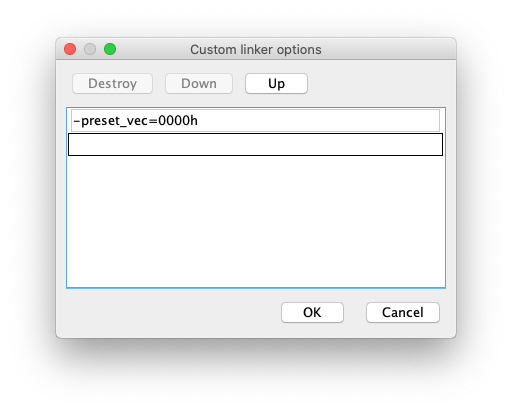
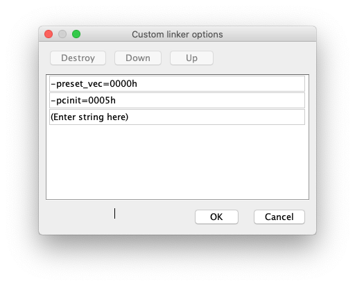
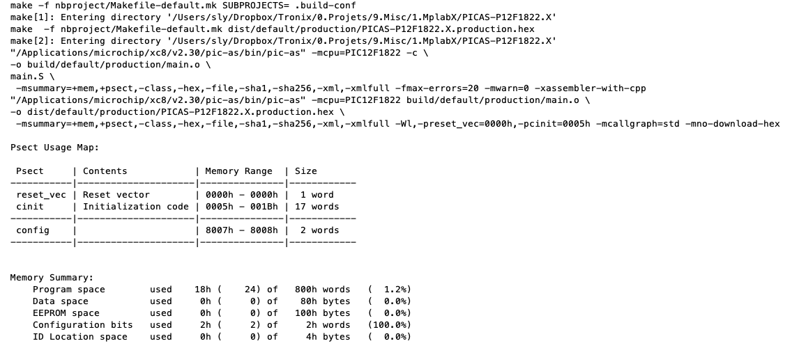

# PIC12F1822 - PIC-AS.

## 0.Contents.

- [1.](#)

## 1..

```c
; Configuration Registers.
CONFIG FOSC=INTOSC
CONFIG WDTE=OFF
CONFIG PWRTE=OFF
CONFIG MCLRE=ON
CONFIG CP=OFF
CONFIG CPD=OFF
CONFIG BOREN=OFF
CONFIG CLKOUTEN=ON
CONFIG IESO=OFF
CONFIG FCMEN=OFF
CONFIG WRT=OFF
CONFIG PLLEN=OFF
CONFIG STVREN=ON
CONFIG BORV=LO
CONFIG LVP=ON

#include <xc.inc>
; PIC12F1822 - Compile with PIC-AS(v2.31).
; PIC12F1822 - @1MHz Internal Oscillator.
    
; PINOUT
; RA4 -> SCOPE.PROBE.A.

; Banks.
#define	BANK0	0x0
#define	BANK1	0x1
#define	BANK2	0x2
#define	BANK3	0x3
#define	BANK4	0x4
#define	BANK5	0x5
#define	BANK6	0x6
#define	BANK7	0x7
    
PSECT reset_vec,class=CODE,space=0,delta=2
reset_vec:
    goto    main

PSECT cinit,class=CODE,space=0,delta=2
main:
    ; MCU Initialization.
    ; Internal Oscillator.
    movlb   BANK1
    movlw   0b01011000
    movwf   OSCCON
    ; Ports Settings.
    ; PORT Data Register.
    movlb   BANK0
    movlw   0b00000000
    movwf   PORTA
    ; TRIS Data Direction.
    movlb   BANK1
    movlw   0b00000000
    movwf   TRISA
    ; WPU Disable.
    bsf	    nWPUEN
    ; LATCH Outputs.
    movlb   BANK2
    movlw   0b00000000
    movwf   LATA
    ; ALTERNATE Pin Function.
    movlw   0b00000000
    movwf   APFCON
    ; ANSEL Analog.
    movlb   BANK3
    movlw   0b00000000
    movwf   ANSELA
    ; WPU Weak Pull-up.
    movlb   BANK4
    movlw   0b00000000
    movwf   WPUA

loop:
    bra	    $-1

    END	    reset_vec
```

```shell
 -msummary=+mem,+psect,-class,-hex,-file,-sha1,-sha256,-xml,-xmlfull -Wl,-preset_vec=0000h,-pcinit=0005h -mcallgraph=std -mno-download-hex

Psect Usage Map:

 Psect     | Contents            | Memory Range  | Size
-----------|---------------------|---------------|------------
 reset_vec | Reset vector        | 0000h - 0000h |  1 word   
 cinit     | Initialization code | 0005h - 001Bh | 17 words  
-----------|---------------------|---------------|------------
 config    |                     | 8007h - 8008h |  2 words  
-----------|---------------------|---------------|------------


Memory Summary:
    Program space        used    17h (    23) of   800h words   (  1.1%)
    Data space           used     0h (     0) of    80h bytes   (  0.0%)
    EEPROM space         used     0h (     0) of   100h bytes   (  0.0%)
    Configuration bits   used     2h (     2) of     2h words   (100.0%)
    ID Location space    used     0h (     0) of     4h bytes   (  0.0%)
```

<p align="center"></p>

<p align="center"></p>

<p align="center"></p>

<p align="center"></p>

```shell
 -msummary=+mem,+psect,-class,-hex,-file,-sha1,-sha256,-xml,-xmlfull -Wl,-preset_vec=0000h -mcallgraph=std -mno-download-hex

Psect Usage Map:

 Psect     | Contents            | Memory Range  | Size
-----------|---------------------|---------------|------------
 reset_vec | Reset vector        | 0000h - 0000h |  1 word   
 cinit     | Initialization code | 07E9h - 07FFh | 17 words  
-----------|---------------------|---------------|------------
 config    |                     | 8007h - 8008h |  2 words  
-----------|---------------------|---------------|------------


Memory Summary:
    Program space        used    17h (    23) of   800h words   (  1.1%)
    Data space           used     0h (     0) of    80h bytes   (  0.0%)
    EEPROM space         used     0h (     0) of   100h bytes   (  0.0%)
    Configuration bits   used     2h (     2) of     2h words   (100.0%)
    ID Location space    used     0h (     0) of     4h bytes   (  0.0%)
```

---
DISCLAIMER: THIS CODE IS PROVIDED WITHOUT ANY WARRANTY OR GUARANTEES.
USERS MAY USE THIS CODE FOR DEVELOPMENT AND EXAMPLE PURPOSES ONLY.
AUTHORS ARE NOT RESPONSIBLE FOR ANY ERRORS, OMISSIONS, OR DAMAGES THAT COULD
RESULT FROM USING THIS FIRMWARE IN WHOLE OR IN PART.