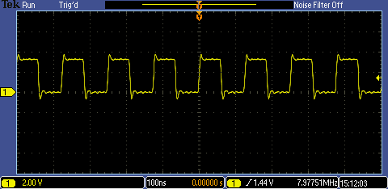

# PIC18FxxJ13 - External Oscillator.

## 0.Contents.

- [1.EC - External Clock.](#1ech---external-clock)

## 1.ECH - External Clock.

```c
// Configuration Registers.
#pragma config WDTEN=OFF, PLLDIV=1, CFGPLLEN=OFF, STVREN=ON, XINST=OFF
#pragma config CP0=OFF, OSC=EC, SOSCSEL=HIGH, CLKOEC=ON, FCMEN=OFF
#pragma config IESO=OFF, WDTPS=32768, DSWDTOSC=INTOSCREF, RTCOSC=T1OSCREF
#pragma config DSBOREN=ON, DSWDTEN=ON, DSWDTPS=G2
#pragma config IOL1WAY=ON, ADCSEL=BIT10, PLLSEL=PLL4X, MSSP7B_EN=MSK7
#pragma config WPFP=PAGE_63, WPCFG=OFF, WPDIS=OFF, WPEND=PAGE_WPFP

#include <xc.h>
// PIC18FxxJ13 - Compile with XC8(v2.31).
// PIC18FxxJ13 - @24.576MHz External Oscillator.
// v0.1 - 06/2020.

// EC External Clock Source.
// Clock Out Enable on RA6.

// MCU.RA6 -> SCOPE.PROBE.A.

// PIC8-Bit Nano Trainer with MEMS DSC1001CI2-024.5760.
// SDA - Open.
// SCL - Open.

// Main.
int main(void)
{
    // MCU Initialization.
    // Oscillator Settings.
    // PLLEN - Software PLL.
    // PLLEN0 = 1 - PLL Enable.
    // PLLEN0 = 0 - PLL Disable.
    OSCTUNEbits.PLLEN = 0b0;
    // REFOCON - Reference Oscillator.
    // REFOCON0 = 1 - REFOCON Enable.
    // REFOCON0 = 0 - REFOCON Disable.
    REFOCONbits.ROON = 0b0;

    while(1){
    }
    return(0);
}
```

- FOSC=24.576MHz, PLLEN=0.

<p align="center"></p>

---
DISCLAIMER: THIS CODE IS PROVIDED WITHOUT ANY WARRANTY OR GUARANTEES.
USERS MAY USE THIS CODE FOR DEVELOPMENT AND EXAMPLE PURPOSES ONLY.
AUTHORS ARE NOT RESPONSIBLE FOR ANY ERRORS, OMISSIONS, OR DAMAGES THAT COULD
RESULT FROM USING THIS FIRMWARE IN WHOLE OR IN PART.