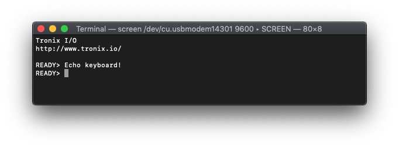

# PIC16F1773/6/7/8/9 - EUSART.

## 0.Contents.

- [1.PIC16F1773/6/8 EUSART Asynchronous.](#1pic16f177368-eusart-asynchronous)
- [2.PIC16F1773/6/8 EUSART Rx Buffer Asynchronous.](#2pic16f177368-eusart-rx-buffer-asynchronous)
- [3.PIC16F1777/9 EUSART Asynchronous.](#3pic16f17779-eusart-asynchronous)

## 1.PIC16F1773/6/8 EUSART Asynchronous.

```c
// Configuration Registers.
#pragma config FOSC = INTOSC, WDTE = OFF, PWRTE = OFF, MCLRE = ON, CP = OFF
#pragma config BOREN = OFF, CLKOUTEN = OFF, IESO = OFF, FCMEN = OFF
#pragma config WRT = OFF, PPS1WAY = ON, ZCD = OFF, PLLEN = OFF
#pragma config STVREN = ON, BORV = LO, LPBOR = OFF, LVP = ON

#include <xc.h>
#include <stdint.h>
#define _XTAL_FREQ 8000000
// PIC16F1777/9 - Compile with XC8(v2.20).
// PIC16F1777/9 - @8MHz Internal Oscillator.
// v0.1 - 07/2020.

// EUSART Asynchronous.

// MCU.RC6.EUSART.UTX.
// MCU.RC7.EUSART.RTX.

// PIC8-Bit Mini Trainer.
// URX - Open.
// UTX - Open.
// SDA - Open.
// SCL - Open.
// VCAP - Open.
// BCKL - Open.

// PIC8-Bit Trainer.
// SDA - Open.
// SCL - Open.
// VEE - Open.
// BCKL - Open.
// VCAP - Open.
// SPI/I2C - Open.

// Definitions.
#define BAUDRATE                           9600
#define BAUDRATE_GENERATOR_BRG16_0_BRGH_0  ((_XTAL_FREQ/BAUDRATE/64)-1)
#define BAUDRATE_GENERATOR_BRG16_0_BRGH_1  ((_XTAL_FREQ/BAUDRATE/16)-1)
#define BAUDRATE_GENERATOR_BRG16_1_BRGH_0  ((_XTAL_FREQ/BAUDRATE/16)-1)
#define BAUDRATE_GENERATOR_BRG16_1_BRGH_1  ((_XTAL_FREQ/BAUDRATE/4)-1)
#define ASCII_CR                           0x0D

// Function Prototypes.
uint8_t eusart_readCharacter(void);
void eusart_writeCharacter(uint8_t u8Data);
void eusart_writeString(const uint8_t * u8Data);

// Strings.
const uint8_t au8Tronix[] = "\r\n\r\nTronix I/O";
const uint8_t au8WWW[] = "\r\nhttp://www.tronix.io/\r\n";
const uint8_t au8Ready[] = "\r\nREADY> ";

// Main.
void main(void)
{
    // MCU Initialization.
    // Oscillator Settings.
    OSCCON = 0x70;
    // Ports Settings.
    // PORT Data Register.
    PORTA = 0b00000000;
    PORTB = 0b00000000;
    PORTC = 0b00000000;
    // TRIS Data Direction.
    TRISA = 0b00000000;
    TRISB = 0b00000000;
    TRISC = 0b10000000;
    // WPU Disable.
    OPTION_REGbits.nWPUEN = 0b1;
    // LATCH Outputs.
    LATA = 0b00000000;
    LATB = 0b00000000;
    LATC = 0b10000000;
    // ANSEL Analog.
    ANSELA = 0b00000000;
    ANSELB = 0b00000000;
    ANSELC = 0b00000000;
    // WPU Weak Pull-up.
    WPUA = 0b00000000;
    WPUB = 0b00000000;
    WPUC = 0b00000000;
    // ODCON Open-drain.
    ODCONA = 0b00000000;
    ODCONB = 0b00000000;
    ODCONC = 0b00000000;
    // SRLCON Slew Rate.
    SLRCONA = 0b11111111;
    SLRCONB = 0b11111111;
    SLRCONC = 0b11111111;
    // INLVL Input Level.
    INLVLA  = 0b00000000;
    INLVLB  = 0b00000000;
    INLVLC  = 0b00000000;
    // HIDRVB High Drive.
    HIDRVB  = 0b00000000;
    // PPS Settings.
    PPSLOCK = 0x55;
    PPSLOCK = 0xAA;
    PPSLOCKbits.PPSLOCKED = 0b0;
    // PPS Inputs.
    RXPPSbits.RXPPS = 0x17;    // RC7 - EUSART.URX.
    // PPS Outputs.
    RC6PPSbits.RC6PPS = 0x24;  // RC6 - EUSART.UTX.
    PPSLOCK = 0x55;
    PPSLOCK = 0xAA;
    PPSLOCKbits.PPSLOCKED = 0b1;

    // EUSART Settings.
    RC1REG = 0;
    TX1REG = 0;
    SP1BRG = BAUDRATE_GENERATOR_BRG16_1_BRGH_1;
    RC1STA = 0x00;
    // CREN - Continuous Receive.
    // CREN = 1 - Enable Receiver.
    // CREN = 0 - Disable Receiver.
    RC1STAbits.CREN = 0b1;
    TX1STA = 0x00;
    // BRGH - High Baud Rate.
    // BRGH = 1 - High Speed.
    // BRGH = 0 - Low Speed.
    TX1STAbits.BRGH = 0b1;
    BAUD1CON = 0x00;
    // BRG16 - 16-Bit Baud Rate.
    // BRG16 = 1 - 16-Bit Register SPBRGH & SPBRG.
    // BRG16 = 0 - 8-Bit Register SPBRG.
    BAUD1CONbits.BRG16 = 0b1;    
    // EUSART Enable.
    RC1STAbits.SPEN = 0b1;
    TX1STAbits.TXEN = 0b1;

    // Display Strings.
    eusart_writeString(au8Tronix);
    eusart_writeString(au8WWW);
    eusart_writeString(au8Ready);

    uint8_t u8Rx;
    while(1){
        if(PIR1bits.RCIF){
            u8Rx = eusart_readCharacter();
            eusart_writeCharacter(u8Rx);
            if(u8Rx == ASCII_CR)
               eusart_writeString(au8Ready);
        }
    }
}

// Functions.
uint8_t eusart_readCharacter(void)
{
    if(RC1STAbits.OERR){
        RC1STAbits.CREN = 0b0;
        RC1STAbits.CREN = 0b1;
    }

    while(!PIR1bits.RCIF){};
    return(RC1REG);
}

void eusart_writeCharacter(uint8_t u8Data)
{
    while(!PIR1bits.TXIF){};
    TX1REG = u8Data;
}

void eusart_writeString(const uint8_t * u8Data)
{
    while(*u8Data != '\0')
        eusart_writeCharacter(*u8Data++);
}
```

<p align="center"></p>

## 2.PIC16F1773/6/8 EUSART Rx Buffer Asynchronous.

```c
// Configuration Registers.
#pragma config FOSC = INTOSC, WDTE = OFF, PWRTE = OFF, MCLRE = ON, CP = OFF
#pragma config BOREN = OFF, CLKOUTEN = OFF, IESO = OFF, FCMEN = OFF
#pragma config WRT = OFF, PPS1WAY = ON, ZCD = OFF, PLLEN = OFF
#pragma config STVREN = ON, BORV = LO, LPBOR = OFF, LVP = ON

#include <xc.h>
#include <stdint.h>
#define _XTAL_FREQ 8000000
// PIC16F1773/6/8 - Compile with XC8(v2.30).
// PIC16F1773/6/8 - @16MHz Internal Oscillator.
// v0.1 - 10/2020.

// EUSART RX Buffer Asynchronous.

// MCU.RC6.EUSART.UTX.
// MCU.RC7.EUSART.RTX.

// PIC8-Bit Mini Trainer.
// URX - Open.
// UTX - Open.
// SDA - Open.
// SCL - Open.
// VCAP - Open.
// BCKL - Open.

// PIC8-Bit Trainer.
// SDA - Open.
// SCL - Open.
// VEE - Open.
// BCKL - Open.
// VCAP - Open.
// SPI/I2C - Open.

// Definitions.
// EUSART.
#define BAUDRATE    9600
// ASCII Characters.
#define ASCII_CR    0x0D

// Function Prototypes.
uint8_t eusart_readCharacter(void);
void eusart_writeCharacter(uint8_t u8Data);
void eusart_writeString(const uint8_t * u8Data);
uint8_t atou8(uint8_t * au8Buffer);

// Strings.
const uint8_t au8Ready[] = "\r\nREADY> ";

// Global Variables.
uint8_t au8RXBuffer[4];

// Main.
void main(void)
{
    // MCU Initialization.
    // Internal Oscillator Settings.
    OSCCON = 0x70;
    // Ports Settings.
    // PORT Data Register.
    PORTA = 0b00000000;
    PORTB = 0b00000000;
    PORTC = 0b00000000;
    // TRIS Data Direction.
    TRISA = 0b00000000;
    TRISB = 0b00000000;
    TRISC = 0b10000000;
    // WPU Disable.
    OPTION_REGbits.nWPUEN = 0b1;
    // LATCH Outputs.
    LATA = 0b00000000;
    LATB = 0b00000000;
    LATC = 0b00000000;
    // ANSEL Analog.
    ANSELA = 0b00000000;
    ANSELB = 0b00000000;
    ANSELC = 0b00000000;
    // WPU Weak Pull-up.
    WPUA = 0b00000000;
    WPUB = 0b00000000;
    WPUC = 0b00000000;
    // ODCON Open-drain.
    ODCONA = 0b00000000;
    ODCONB = 0b00000000;
    ODCONC = 0b00000000;
    // SRLCON Slew Rate.
    SLRCONA = 0b11111111;
    SLRCONB = 0b11111111;
    SLRCONC = 0b11111111;
    // INLVL Input Level.
    INLVLA  = 0b00000000;
    INLVLB  = 0b00000000;
    INLVLC  = 0b00000000;
    // HIDRVB High Drive.
    HIDRVB  = 0b00000000;
    // PPS Settings.
    PPSLOCK = 0x55;
    PPSLOCK = 0xAA;  
    PPSLOCKbits.PPSLOCKED = 0b0;  
    // PPS Inputs.
    RXPPSbits.RXPPS = 0x17;     // RC7 - EUSART.URX.
    // PPS Outputs.
    RC6PPSbits.RC6PPS = 0x24;   // RC6 - EUSART.UTX.
    PPSLOCK = 0x55;
    PPSLOCK = 0xAA;
    PPSLOCKbits.PPSLOCKED = 0b1;

    // EUSART Settings.
    RC1REG = 0;
    TX1REG = 0;
    SP1BRG = ((_XTAL_FREQ/BAUDRATE/4)-1);
    RC1STA = 0x10;
    TX1STA = 0x24;
    BAUD1CON = 0x08;
    // EUSART Enable.
    RC1STAbits.SPEN = 0b1;

    // Display Strings.
    eusart_writeString(au8Ready);

    uint8_t u8Index = 0, u8Rx;
    while(1){
        if(PIR1bits.RCIF){
            u8Rx = eusart_readCharacter();
            au8RXBuffer[u8Index] = u8Rx;
            eusart_writeCharacter(u8Rx);
            u8Index++;
            
            if(u8Rx == ASCII_CR){
                eusart_writeString(au8Ready);
                LATB = atou8(au8RXBuffer);
                u8Index = 0;
            }
        }
    }
}

// Functions.
uint8_t eusart_readCharacter(void)
{
    if(RC1STAbits.OERR){
        RC1STAbits.CREN = 0b0;
        RC1STAbits.CREN = 0b1;
    }

    while(!PIR1bits.RCIF){};
    return(RC1REG);
}

void eusart_writeCharacter(uint8_t u8Data)
{
    while(!PIR1bits.TXIF){};
    TX1REG = u8Data;
}

void eusart_writeString(const uint8_t * u8Data)
{
    while(*u8Data != '\0')
        eusart_writeCharacter(*u8Data++);
}

uint8_t atou8(uint8_t * au8Buffer)
{
    uint8_t	au8Data = 0;

    while(*au8Buffer <= '9' && *au8Buffer >= '0')
		au8Data = au8Data * 10 + (*au8Buffer++ - '0');

	return(au8Data);
}
```

## 3.PIC16F1777/9 EUSART Asynchronous.

```c
// Configuration Registers.
#pragma config FOSC = INTOSC, WDTE = OFF, PWRTE = OFF, MCLRE = ON, CP = OFF
#pragma config BOREN = OFF, CLKOUTEN = OFF, IESO = OFF, FCMEN = OFF
#pragma config WRT = OFF, PPS1WAY = ON, ZCD = OFF, PLLEN = OFF
#pragma config STVREN = ON, BORV = LO, LPBOR = OFF, LVP = ON

#include <xc.h>
#include <stdint.h>
#define _XTAL_FREQ 8000000
// PIC16F1777/9 - Compile with XC8(v2.20).
// PIC16F1777/9 - @8MHz Internal Oscillator.
// v0.1 - 07/2020.

// EUSART Asynchronous.

// MCU.RC6.EUSART.UTX.
// MCU.RC7.EUSART.RTX.

// PIC8-Bit Nano Trainer.
// SDA - Open.
// SCL - Open.

// Definitions.
#define BAUDRATE                           9600
#define BAUDRATE_GENERATOR_BRG16_0_BRGH_0  ((_XTAL_FREQ/BAUDRATE/64)-1)
#define BAUDRATE_GENERATOR_BRG16_0_BRGH_1  ((_XTAL_FREQ/BAUDRATE/16)-1)
#define BAUDRATE_GENERATOR_BRG16_1_BRGH_0  ((_XTAL_FREQ/BAUDRATE/16)-1)
#define BAUDRATE_GENERATOR_BRG16_1_BRGH_1  ((_XTAL_FREQ/BAUDRATE/4)-1)
// ASCII Characters.
#define ASCII_CR                           0x0D

// Function Prototypes.
uint8_t eusart_readCharacter(void);
void eusart_writeCharacter(uint8_t u8Data);
void eusart_writeString(const uint8_t * u8Data);

// Strings.
const uint8_t au8Tronix[] = "\r\n\r\nTronix I/O";
const uint8_t au8WWW[] = "\r\nhttp://www.tronix.io/\r\n";
const uint8_t au8Ready[] = "\r\nREADY> ";

// Main.
void main(void)
{
    // MCU Initialization.
    // Oscillator Settings.
    OSCCON = 0x70;
    // Ports Settings.
    // PORT Data Register.
    PORTA = 0b00000000;
    PORTB = 0b00000000;
    PORTC = 0b00000000;
    PORTD = 0b00000000;
    PORTE = 0b0000;
    // TRIS Data Direction.
    TRISA = 0b00000000;
    TRISB = 0b00000000;
    TRISC = 0b10000000;
    TRISD = 0b00000000;
    TRISE = 0b0000;
    // WPU Disable.
    OPTION_REGbits.nWPUEN = 0b1;
    // LATCH Outputs.
    LATA = 0b00000000;
    LATB = 0b00000000;
    LATC = 0b10000000;
    LATD = 0b00000000;
    LATE = 0b0000;
    // ANSEL Analog.
    ANSELA = 0b00000000;
    ANSELB = 0b00000000;
    ANSELC = 0b00000000;
    ANSELD = 0b00000000;
    ANSELE = 0b0000;
    // WPU Weak Pull-up.
    WPUA = 0b00000000;
    WPUB = 0b00000000;
    WPUC = 0b00000000;
    WPUD = 0b00000000;
    WPUE = 0b0000;
    // ODCON Open-drain.
    ODCONA = 0b00000000;
    ODCONB = 0b00000000;
    ODCONC = 0b00000000;
    ODCOND = 0b00000000;
    ODCONE = 0b0000;
    // SRLCON Slew Rate.
    SLRCONA = 0b11111111;
    SLRCONB = 0b11111111;
    SLRCONC = 0b11111111;
    SLRCOND = 0b11111111;
    SLRCONE = 0b1111;
    // INLVL Input Level.
    INLVLA  = 0b00000000;
    INLVLB  = 0b00000000;
    INLVLC  = 0b00000000;
    INLVLD  = 0b00000000;
    // HIDRVB High Drive.
    HIDRVB  = 0b00000000;
    // PPS Settings.
    PPSLOCK = 0x55;
    PPSLOCK = 0xAA;
    PPSLOCKbits.PPSLOCKED = 0b0;
    // PPS Inputs.
    RXPPSbits.RXPPS = 0x17;    // RC7 - EUSART.URX.
    // PPS Outputs.
    RC6PPSbits.RC6PPS = 0x24;  // RC6 - EUSART.UTX.
    PPSLOCK = 0x55;
    PPSLOCK = 0xAA;
    PPSLOCKbits.PPSLOCKED = 0b1;

    // EUSART Settings.
    RC1REG = 0;
    TX1REG = 0;
    SP1BRG = BAUDRATE_GENERATOR_BRG16_1_BRGH_1;
    RC1STA = 0x00;
    // CREN - Continuous Receive.
    // CREN = 1 - Enable Receiver.
    // CREN = 0 - Disable Receiver.
    RC1STAbits.CREN = 0b1;
    TX1STA = 0x00;
    // BRGH - High Baud Rate.
    // BRGH = 1 - High Speed.
    // BRGH = 0 - Low Speed.
    TX1STAbits.BRGH = 0b1;
    BAUD1CON = 0x00;
    // BRG16 - 16-Bit Baud Rate.
    // BRG16 = 1 - 16-Bit Register SPBRGH & SPBRG.
    // BRG16 = 0 - 8-Bit Register SPBRG.
    BAUD1CONbits.BRG16 = 0b1;    
    // EUSART Enable.
    RC1STAbits.SPEN = 0b1;
    TX1STAbits.TXEN = 0b1;

    // Display Strings.
    eusart_writeString(au8Tronix);
    eusart_writeString(au8WWW);
    eusart_writeString(au8Ready);

    uint8_t u8Rx;
    while(1){
        if(PIR1bits.RCIF){
            u8Rx = eusart_readCharacter();
            eusart_writeCharacter(u8Rx);
            if(u8Rx == ASCII_CR)
               eusart_writeString(au8Ready);
        }
    }
}

// Functions.
uint8_t eusart_readCharacter(void)
{
    if(RC1STAbits.OERR){
        RC1STAbits.CREN = 0b0;
        RC1STAbits.CREN = 0b1;
    }

    while(!PIR1bits.RCIF){};
    return(RC1REG);
}

void eusart_writeCharacter(uint8_t u8Data)
{
    while(!PIR1bits.TXIF){};
    TX1REG = u8Data;
}

void eusart_writeString(const uint8_t * u8Data)
{
    while(*u8Data != '\0')
        eusart_writeCharacter(*u8Data++);
}
```

<p align="center"></p>

---
DISCLAIMER: THIS CODE IS PROVIDED WITHOUT ANY WARRANTY OR GUARANTEES.
USERS MAY USE THIS CODE FOR DEVELOPMENT AND EXAMPLE PURPOSES ONLY.
AUTHORS ARE NOT RESPONSIBLE FOR ANY ERRORS, OMISSIONS, OR DAMAGES THAT COULD
RESULT FROM USING THIS FIRMWARE IN WHOLE OR IN PART.