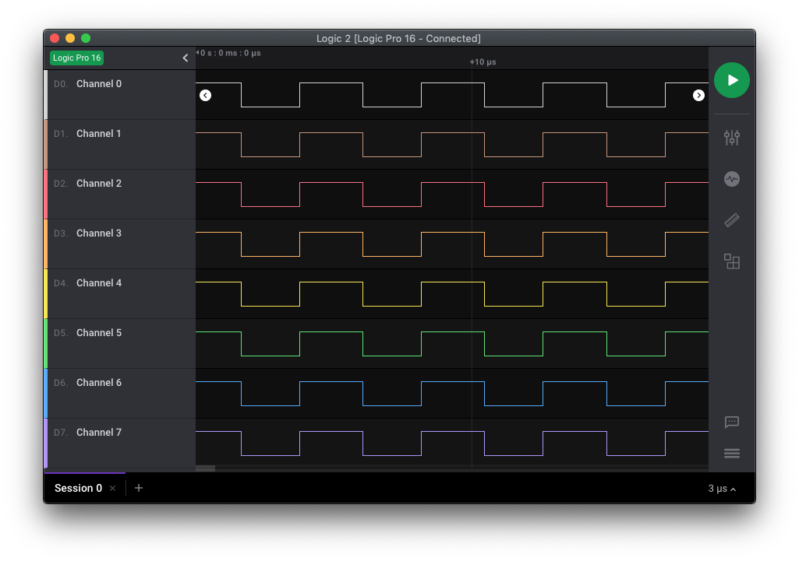
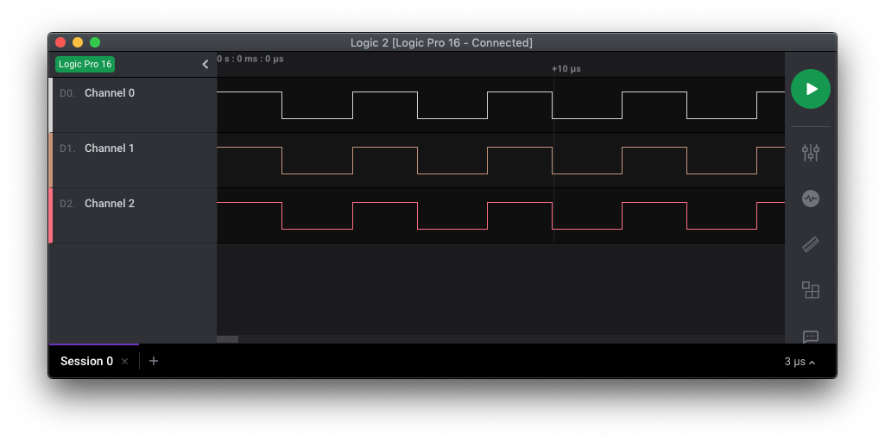
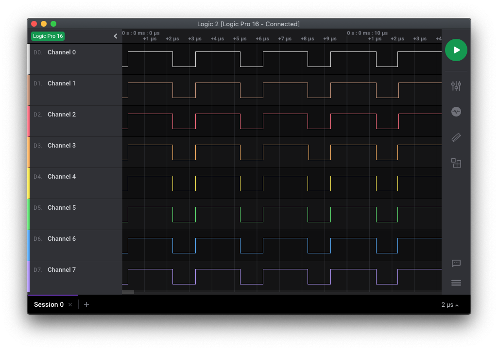

# PIC16F1777/8/9 - GPIO.

## 0.Contents.

- [1.PIC16F1778 GPIO.](#1pic16f177368-gpio)
- [2.PIC16F1777/9 GPIO.](#2pic16f17779-gpio)
- [3.PIC16F1778 GPIO PIC-AS.](#1pic16f177368-gpio-pic---as)

## 1.PIC16F1778 GPIO.

```c
// Configuration Registers.
#pragma config FOSC = INTOSC, WDTE = OFF, PWRTE = OFF, MCLRE = ON, CP = OFF
#pragma config BOREN = OFF, CLKOUTEN = OFF, IESO = OFF, FCMEN = OFF
#pragma config WRT = OFF, PPS1WAY = ON, ZCD = OFF, PLLEN = OFF
#pragma config STVREN = ON, BORV = LO, LPBOR = OFF, LVP = ON

#include <xc.h>
#define _XTAL_FREQ 8000000
// PIC16F1778 - Compile with XC8(v2.31).
// PIC16F1778 - @8MHz Internal Oscillator.

// I/O Ports.

// PIC8-Bit Mini Trainer.
// URX - Not Use.
// UTX - Not Use.
// SDA - Not Use.
// SCL - Not Use.
// VCAP - Open.
// BCKL - Not Use.

// PIC8-Bit Trainer.
// SDA - Not Use.
// SCL - Not Use.
// VEE - Not Use.
// BCKL - Not Use.
// VCAP - Open.
// SPI/I2C - Not Use.

// Main.
void main(void)
{
    // MCU Initialization.
    // Oscillator Settings.
    OSCCON = 0x70;
    // Ports Settings.
    // PORT Data Register.
    PORTA = 0b00000000;
    PORTB = 0b00000000;
    PORTC = 0b00000000;
    // TRIS Data Direction.
    TRISA = 0b00000000;
    TRISB = 0b00000000;
    TRISC = 0b00000000;
    // WPU Disable.
    OPTION_REGbits.nWPUEN = 0b1;
    // LATCH Outputs.
    LATA = 0b00000000;
    LATB = 0b00000000;
    LATC = 0b00000000;
    // ANSEL Analog.
    ANSELA = 0b00000000;
    ANSELB = 0b00000000;
    ANSELC = 0b00000000;
    // WPU Weak Pull-up.
    WPUA = 0b00000000;
    WPUB = 0b00000000;
    WPUC = 0b00000000;
    // ODCON Open-drain.
    ODCONA = 0b00000000;
    ODCONB = 0b00000000;
    ODCONC = 0b00000000;
    // SRLCON Slew Rate.
    SLRCONA = 0b11111111;
    SLRCONB = 0b11111111;
    SLRCONC = 0b11111111;
    // INLVL Input Level.
    INLVLA  = 0b00000000;
    INLVLB  = 0b00000000;
    INLVLC  = 0b00000000;
    // HIDRVB High Drive.
    HIDRVB  = 0b00000000;

    while(1){
        LATA = ~LATA;
//        LATB = ~LATB;
//        LATC = ~LATC;
    }
}
```

- Port A/B/C.

<p align="center"></p>

## 2.PIC16F1777/9 GPIO.

```c
// Configuration Registers.
#pragma config FOSC = INTOSC, WDTE = OFF, PWRTE = OFF, MCLRE = ON, CP = OFF
#pragma config BOREN = OFF, CLKOUTEN = OFF, IESO = OFF, FCMEN = OFF
#pragma config WRT = OFF, PPS1WAY = ON, ZCD = OFF, PLLEN = OFF
#pragma config STVREN = ON, BORV = LO, LPBOR = OFF, LVP = ON

#include <xc.h>
#define _XTAL_FREQ 8000000
// PIC16F1777/9 - Compile with XC8(v2.31).
// PIC16F1777/9 - @8MHz Internal Oscillator.

// I/O Ports.

// PIC8-Bit Nano Trainer.
// SDA - Not Use.
// SCL - Not Use.

// Main.
void main(void)
{
    // MCU Initialization.
    // Oscillator Settings.
    OSCCON = 0x70;
    // Ports Settings.
    // PORT Data Register.
    PORTA = 0b00000000;
    PORTB = 0b00000000;
    PORTC = 0b00000000;
    PORTD = 0b00000000;
    PORTE = 0b0000;
    // TRIS Data Direction.
    TRISA = 0b00000000;
    TRISB = 0b00000000;
    TRISC = 0b00000000;
    TRISD = 0b00000000;
    TRISE = 0b0000;
    // WPU Disable.
    OPTION_REGbits.nWPUEN = 0b1;
    // LATCH Outputs.
    LATA = 0b00000000;
    LATB = 0b00000000;
    LATC = 0b00000000;
    LATD = 0b00000000;
    LATE = 0b0000;
    // ANSEL Analog.
    ANSELA = 0b00000000;
    ANSELB = 0b00000000;
    ANSELC = 0b00000000;
    ANSELD = 0b00000000;
    ANSELE = 0b0000;
    // WPU Weak Pull-up.
    WPUA = 0b00000000;
    WPUB = 0b00000000;
    WPUC = 0b00000000;
    WPUD = 0b00000000;
    WPUE = 0b0000;
    // ODCON Open-drain.
    ODCONA = 0b00000000;
    ODCONB = 0b00000000;
    ODCONC = 0b00000000;
    ODCOND = 0b00000000;
    ODCONE = 0b0000;
    // SRLCON Slew Rate.
    SLRCONA = 0b11111111;
    SLRCONB = 0b11111111;
    SLRCONC = 0b11111111;
    SLRCOND = 0b11111111;
    SLRCONE = 0b1111;
    // INLVL Input Level.
    INLVLA  = 0b00000000;
    INLVLB  = 0b00000000;
    INLVLC  = 0b00000000;
    INLVLD = 0b00000000;
    // HIDRVB High Drive.
    HIDRVB  = 0b00000000;

    while(1){
        LATA = ~LATA;
//        LATB = ~LATB;
//        LATC = ~LATC;
//        LATD = ~LATD;
//        LATE = ~LATE;
    }
    return(0);
}
```

- Port A/B/C/D.

<p align="center"></p>

- Port E.

<p align="center"></p>

## 3.PIC16F1778 GPIO PIC-AS.

```c
// Configuration Registers.
CONFIG FOSC=INTOSC
CONFIG WDTE=OFF
CONFIG PWRTE=OFF
CONFIG MCLRE=ON
CONFIG CP=OFF
CONFIG BOREN=OFF
CONFIG CLKOUTEN=OFF
CONFIG IESO=OFF
CONFIG FCMEN=OFF
CONFIG WRT=OFF
CONFIG PPS1WAY=ON
CONFIG ZCD=OFF
CONFIG PLLEN=OFF
CONFIG STVREN=ON
CONFIG BORV=LO
CONFIG LPBOR=OFF
CONFIG LVP=ON

#include <xc.inc>
// PIC16F1778 - Compile with PIC-AS(v2.31).
// PIC16F1778 - @8MHz Internal Oscillator.

PSECT resetVec,class=CODE,delta=2
resetVect:
    PAGESEL main
    goto    main

PSECT code
// Main.
main:
    // MCU Initialization.
    // Internal Oscillator.
    PAGESEL loop
    banksel OSCCON
    movlw   0x70
    movwf   OSCCON
    // Ports Settings.
    // PORT Data Register.
    banksel PORTA
    movlw   0b00000000
    movwf   PORTA
    movlw   0b00000000
    movwf   PORTB
    movlw   0b00000000
    movwf   PORTC
    // TRIS Data Direction.
    banksel TRISA
    movlw   0b00000000
    movwf   TRISA
    movlw   0b00000000
    movwf   TRISB
    movlw   0b00000000
    movwf   TRISC
    // WPU Disable.
;    banksel OPTION_REG
    bsf	    nWPUEN
    // LATCH Outputs.
    banksel LATA
    movlw   0b00000000
    movwf   LATA
    movlw   0b00000000
    movwf   LATB
    movlw   0b00000000
    movwf   LATC
    // ANSEL Analog.
    banksel ANSELA
    movlw   0b00000000
    movwf   ANSELA
    movlw   0b00000000
    movwf   ANSELB
    movlw   0b00000000
    movwf   ANSELC
    // WPU Weak Pull-up.
    banksel WPUA
    movlw   0b00000000
    movwf   WPUA
    movlw   0b00000000
    movwf   WPUB
    movlw   0b00000000
    movwf   WPUC
    // ODCON Open-drain.
    banksel ODCONA
    movlw   0b00000000
    movwf   ODCONA
    movlw   0b00000000
    movwf   ODCONB
    movlw   0b00000000
    movwf   ODCONC
    // SRLCON Slew Rate.
    banksel SLRCONA
    movlw   0b11111111
    movwf   SLRCONA
    movlw   0b11111111
    movwf   SLRCONB
    movlw   0b11111111
    movwf   SLRCONC
    // INLVL Input Level.
    banksel INLVLA
    movlw   0b00000000
    movwf   INLVLA
    movlw   0b00000000
    movwf   INLVLB
    movlw   0b00000000
    movwf   INLVLC
    // HIDRVB High Drive.
    banksel HIDRVB
    clrf    HIDRVB

    banksel LATA
loop:
    movlw   0x00
    movwf   LATA
;    movwf   LATB
;    movwf   LATC
    movlw   0xff
    movwf   LATA
;    movwf   LATB
;    movwf   LATC
    goto    loop
    
    END	    resetVect
```

- Port A/B/C.

<p align="center"></p>


---
DISCLAIMER: THIS CODE IS PROVIDED WITHOUT ANY WARRANTY OR GUARANTEES.
USERS MAY USE THIS CODE FOR DEVELOPMENT AND EXAMPLE PURPOSES ONLY.
AUTHORS ARE NOT RESPONSIBLE FOR ANY ERRORS, OMISSIONS, OR DAMAGES THAT COULD
RESULT FROM USING THIS FIRMWARE IN WHOLE OR IN PART.