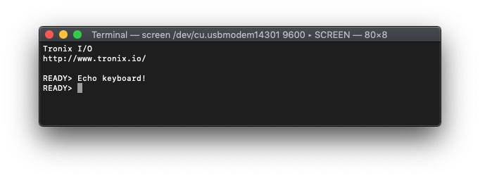

# PIC18FxxJ13 - EUSART.

## 0.Contents.

- [1.PIC18F2xJ13 EUSART Asynchronous.](#1pic18f2xj13-eusart-asynchronous)
- [2.PIC18F4xJ13 EUSART Asynchronous.](#2pic18f4xj13-eusart-asynchronous)

## 1.PIC18F2xJ13 EUSART Asynchronous.

```c
// Configuration Registers.
#pragma config WDTEN=OFF, PLLDIV=1, CFGPLLEN=OFF, STVREN=ON, XINST=OFF
#pragma config CP0=OFF, OSC=INTOSC, SOSCSEL=HIGH, CLKOEC=OFF, FCMEN=OFF
#pragma config IESO=OFF, WDTPS=32768, DSWDTOSC=INTOSCREF, RTCOSC=T1OSCREF
#pragma config DSBOREN=ON, DSWDTEN=ON, DSWDTPS=G2
#pragma config IOL1WAY=ON, ADCSEL=BIT10, PLLSEL=PLL4X, MSSP7B_EN=MSK7
#pragma config WPFP=PAGE_63, WPCFG=OFF, WPDIS=OFF, WPEND=PAGE_WPFP

#include <xc.h>
#include <stdint.h>
#define _XTAL_FREQ 8000000
// PIC18F4xJ13 - Compile with XC8(v2.20).
// PIC18F4xJ13 - @8MHz Internal Oscillator.
// v0.1 - 07/2020.

// EUSART Asynchronous.

// MCU.RC6.EUSART.UTX.
// MCU.RC7.EUSART.RTX.

// PIC8-Bit Mini Trainer.
// URX - Open.
// UTX - Open.
// SDA - Open.
// SCL - Open.
// VCAP - Close.
// BCKL - Open.

// PIC8-Bit Trainer.
// SDA - Open.
// SCL - Open.
// VEE - Open.
// BCKL - Open.
// VCAP - Close.
// SPI/I2C - Open.

// Definitions.
#define BAUDRATE                           9600
#define BAUDRATE_GENERATOR_BRG16_0_BRGH_0  ((_XTAL_FREQ/BAUDRATE/64)-1)
#define BAUDRATE_GENERATOR_BRG16_0_BRGH_1  ((_XTAL_FREQ/BAUDRATE/16)-1)
#define BAUDRATE_GENERATOR_BRG16_1_BRGH_0  ((_XTAL_FREQ/BAUDRATE/16)-1)
#define BAUDRATE_GENERATOR_BRG16_1_BRGH_1  ((_XTAL_FREQ/BAUDRATE/4)-1)
#define ASCII_CR                           0x0D

// Functions Prototype.
uint8_t eusart_readCharacter(void);
void eusart_writeCharacter(uint8_t u8Data);
void eusart_writeString(const uint8_t * u8Data);

// Strings & Custom patterns.
const uint8_t au8Tronix[] = "\r\n\r\nTronix I/O";
const uint8_t au8WWW[] = "\r\nhttp://www.tronix.io/\r\n";
const uint8_t au8Ready[] = "\r\nREADY> ";

// Main.
int main(void)
{
    // MCU Initialization.
    // Oscillator Settings.
    OSCCON = 0x70;
    // Ports Settings.
    // Analog Inputs.
    ANCON0 = 0b11111111;
    ANCON1 = 0b00011111;
    // TRIS Data Direction.
    TRISC = 0b10000000;
    TRISB = 0b00000000;
    TRISA = 0b00000000;
    // LATCH Outputs.
    LATC = 0b10000000;
    LATB = 0b00000000;
    LATA = 0b00000000;
    // PORT Data Register.
    PORTC = 0b00000000;
    PORTB = 0b00000000;
    PORTA = 0b00000000;
    // ODCON Open-drain.
    ODCON1 = 0b00000000;
    ODCON2 = 0b00000000;
    ODCON3 = 0b00000000;

    // EUSART Settings.
    RCREG1 = 0;
    TXREG1 = 0;
    SPBRG1 = BAUDRATE_GENERATOR_BRG16_1_BRGH_1;
    TXSTA1 = 0x00;
    // BRGH - High Baud Rate.
    // BRGH = 1 - High Speed.
    // BRGH = 0 - Low Speed.
    TXSTA1bits.BRGH = 0b1;
    RCSTA1 = 0x00;
    // CREN - Continuous Receive.
    // CREN = 1 - Enable Receiver.
    // CREN = 0 - Disable Receiver.
    RCSTA1bits.CREN = 0b1;
    BAUDCON1 = 0x00;
    // BRG16 - 16-Bit Baud Rate.
    // BRG16 = 1 - 16-Bit Register SPBRGH & SPBRG.
    // BRG16 = 0 - 8-Bit Register SPBRG.
    BAUDCON1bits.BRG16 = 0b1;
     // EUSART Enable.
    RCSTA1bits.SPEN = 0b1;
    TXSTA1bits.TXEN = 0b1;

    // Display Strings.
    eusart_writeString(au8Tronix);
    eusart_writeString(au8WWW);
    eusart_writeString(au8Ready);

    uint8_t u8Rx;
    while(1){
        if(PIR1bits.RCIF){
            u8Rx = eusart_readCharacter();
            eusart_writeCharacter(u8Rx);
            if(u8Rx == ASCII_CR)
               eusart_writeString(au8Ready);
        }
    }
    return(0);
}

// Functions.
uint8_t eusart_readCharacter(void)
{
    if(RCSTA1bits.OERR){
        RCSTA1bits.CREN = 0b0;
        RCSTA1bits.CREN = 0b1;
    }

    while(!PIR1bits.RC1IF){};
    return(RCREG);
}

void eusart_writeCharacter(uint8_t u8Data)
{
    while(!PIR1bits.TX1IF){};
    TXREG1 = u8Data;
}

void eusart_writeString(const uint8_t * u8Data)
{
    while(*u8Data != '\0')
        eusart_writeCharacter(*u8Data++);
}
```

<p align="center"></p>

## 2.PIC18F4xJ13 EUSART Asynchronous.

```c
// Configuration Registers.
#pragma config WDTEN=OFF, PLLDIV=1, CFGPLLEN=OFF, STVREN=ON, XINST=OFF
#pragma config CP0=OFF, OSC=INTOSC, SOSCSEL=HIGH, CLKOEC=OFF, FCMEN=OFF
#pragma config IESO=OFF, WDTPS=32768, DSWDTOSC=INTOSCREF, RTCOSC=T1OSCREF
#pragma config DSBOREN=ON, DSWDTEN=ON, DSWDTPS=G2
#pragma config IOL1WAY=ON, ADCSEL=BIT10, PLLSEL=PLL4X, MSSP7B_EN=MSK7
#pragma config WPFP=PAGE_63, WPCFG=OFF, WPDIS=OFF, WPEND=PAGE_WPFP

#include <xc.h>
#include <stdint.h>
#define _XTAL_FREQ 8000000
// PIC18F4xJ13 - Compile with XC8(v2.20).
// PIC18F4xJ13 - @8MHz Internal Oscillator.
// v0.1 - 07/2020.

// EUSART Asynchronous.

// MCU.RC6.EUSART.UTX.
// MCU.RC7.EUSART.RTX.

// PIC8-Bit Nano Trainer.
// SDA - Open.
// SCL - Open.

// Definitions.
#define BAUDRATE                           9600
#define BAUDRATE_GENERATOR_BRG16_0_BRGH_0  ((_XTAL_FREQ/BAUDRATE/64)-1)
#define BAUDRATE_GENERATOR_BRG16_0_BRGH_1  ((_XTAL_FREQ/BAUDRATE/16)-1)
#define BAUDRATE_GENERATOR_BRG16_1_BRGH_0  ((_XTAL_FREQ/BAUDRATE/16)-1)
#define BAUDRATE_GENERATOR_BRG16_1_BRGH_1  ((_XTAL_FREQ/BAUDRATE/4)-1)
#define ASCII_CR                           0x0D

// Functions Prototype.
uint8_t eusart_readCharacter(void);
void eusart_writeCharacter(uint8_t u8Data);
void eusart_writeString(const uint8_t * u8Data);

// Strings & Custom patterns.
const uint8_t au8Tronix[] = "\r\n\r\nTronix I/O";
const uint8_t au8WWW[] = "\r\nhttp://www.tronix.io/\r\n";
const uint8_t au8Ready[] = "\r\nREADY> ";

// Main.
int main(void)
{
    // MCU Initialization.
    // Oscillator Settings.
    OSCCON = 0x70;
    // Ports Settings.
    // Analog Inputs.
    ANCON0 = 0b11111111;
    ANCON1 = 0b00011111;
    // TRIS Data Direction.
    TRISE = 0b00000000;
    TRISD = 0b00000000;
    TRISC = 0b10000000;
    TRISB = 0b00000000;
    TRISA = 0b00000000;
    // LATCH Outputs.
    LATE = 0b00000000;
    LATD = 0b00000000;
    LATC = 0b10000000;
    LATB = 0b00000000;
    LATA = 0b00000000;
    // PORT Data Register.
    PORTE = 0b00000000;
    PORTD = 0b00000000;
    PORTC = 0b00000000;
    PORTB = 0b00000000;
    PORTA = 0b00000000;
    // ODCON Open-drain.
    ODCON1 = 0b00000000;
    ODCON2 = 0b00000000;
    ODCON3 = 0b00000000;

    // EUSART Settings.
    RCREG1 = 0;
    TXREG1 = 0;
    SPBRG1 = BAUDRATE_GENERATOR_BRG16_1_BRGH_1;
    TXSTA1 = 0x00;
    // BRGH - High Baud Rate.
    // BRGH = 1 - High Speed.
    // BRGH = 0 - Low Speed.
    TXSTA1bits.BRGH = 0b1;
    RCSTA1 = 0x00;
    // CREN - Continuous Receive.
    // CREN = 1 - Enable Receiver.
    // CREN = 0 - Disable Receiver.
    RCSTA1bits.CREN = 0b1;
    BAUDCON1 = 0x00;
    // BRG16 - 16-Bit Baud Rate.
    // BRG16 = 1 - 16-Bit Register SPBRGH & SPBRG.
    // BRG16 = 0 - 8-Bit Register SPBRG.
    BAUDCON1bits.BRG16 = 0b1;
     // EUSART Enable.
    RCSTA1bits.SPEN = 0b1;
    TXSTA1bits.TXEN = 0b1;

    // Display Strings.
    eusart_writeString(au8Tronix);
    eusart_writeString(au8WWW);
    eusart_writeString(au8Ready);

    uint8_t u8Rx;
    while(1){
        if(PIR1bits.RCIF){
            u8Rx = eusart_readCharacter();
            eusart_writeCharacter(u8Rx);
            if(u8Rx == ASCII_CR)
               eusart_writeString(au8Ready);
        }
    }
    return(0);
}

// Functions.
uint8_t eusart_readCharacter(void)
{
    if(RCSTA1bits.OERR){
        RCSTA1bits.CREN = 0b0;
        RCSTA1bits.CREN = 0b1;
    }

    while(!PIR1bits.RC1IF){};
    return(RCREG);
}

void eusart_writeCharacter(uint8_t u8Data)
{
    while(!PIR1bits.TX1IF){};
    TXREG1 = u8Data;
}

void eusart_writeString(const uint8_t * u8Data)
{
    while(*u8Data != '\0')
        eusart_writeCharacter(*u8Data++);
}
```

<p align="center"></p>

---
DISCLAIMER: THIS CODE IS PROVIDED WITHOUT ANY WARRANTY OR GUARANTEES.
USERS MAY USE THIS CODE FOR DEVELOPMENT AND EXAMPLE PURPOSES ONLY.
AUTHORS ARE NOT RESPONSIBLE FOR ANY ERRORS, OMISSIONS, OR DAMAGES THAT COULD
RESULT FROM USING THIS FIRMWARE IN WHOLE OR IN PART.