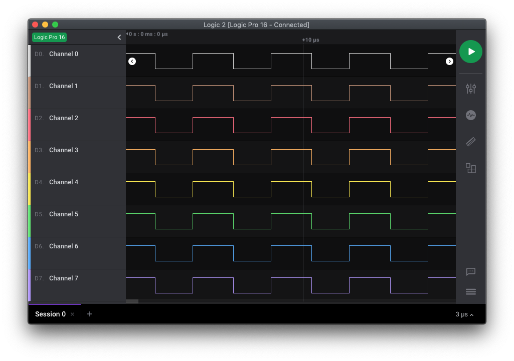

# PIC18FxxJ13 - GPIO.

## 0.Contents.

- [1.PIC18F2xJ13 GPIO.](#1pic18f2xj13-gpio)
- [2.PIC18F4xJ13 GPIO.](#2pic18f4xj13-gpio)

## 1.PIC18F2xJ13 GPIO.

```c
// Configuration Registers.
#pragma config WDTEN=OFF, PLLDIV=1, CFGPLLEN=OFF, STVREN=ON, XINST=OFF
#pragma config CP0=OFF, OSC=INTOSC, SOSCSEL=HIGH, CLKOEC=OFF, FCMEN=OFF
#pragma config IESO=OFF, WDTPS=32768, DSWDTOSC=INTOSCREF, RTCOSC=T1OSCREF
#pragma config DSBOREN=ON, DSWDTEN=ON, DSWDTPS=G2
#pragma config IOL1WAY=ON, ADCSEL=BIT10, PLLSEL=PLL4X, MSSP7B_EN=MSK7
#pragma config WPFP=PAGE_63, WPCFG=OFF, WPDIS=OFF, WPEND=PAGE_WPFP

#include <xc.h>
#define _XTAL_FREQ 8000000
// PIC18F2xJ13 - Compile with XC8(v2.31).
// PIC18F2xJ13 - @8MHz Internal Oscillator.
// v0.1 - 06/2020.

// I/O Ports

// PIC8-Bit Mini Trainer.
// URX - Open.
// UTX - Open.
// SDA - Open.
// SCL - Open.
// VCAP - Close.
// BCKL - Open.

// PIC8-Bit Trainer.
// SDA - Open.
// SCL - Open.
// VEE - Open.
// BCKL - Open.
// VCAP - Close.
// SPI/I2C - Open.

// Main.
int main(void)
{
    // MCU Initialization.
    // Oscillator Settings.
    OSCCON = 0x70;
    // Ports Settings.
    // Analog Inputs.
    ANCON0 = 0b00011111;
    ANCON1 = 0b00011111;
    // TRIS Data Direction.
    TRISC = 0b00000000;
    TRISB = 0b00000000;
    TRISA = 0b00000000;
    // LATCH Outputs.
    LATC = 0b00000000;
    LATB = 0b00000000;
    LATA = 0b00000000;
    // PORT Data Register.
    PORTC = 0b00000000;
    PORTB = 0b00000000;
    PORTA = 0b00000000;
    // ODCON Open-drain.
    ODCON1 = 0b00000000;
    ODCON2 = 0b00000000;
    ODCON3 = 0b00000000;

    while(1){
        LATA = ~LATA;
//        LATB = ~LATB;
//        LATD = ~LATD;
    }
    return(0);
}
```

- Port A.

<p align="center"></p>

- Port B/C.

<p align="center"></p>

## 2.PIC18F4xJ13 GPIO.

```c
// Configuration Registers.
#pragma config WDTEN=OFF, PLLDIV=1, CFGPLLEN=OFF, STVREN=ON, XINST=OFF
#pragma config CP0=OFF, OSC=INTOSC, SOSCSEL=HIGH, CLKOEC=OFF, FCMEN=OFF
#pragma config IESO=OFF, WDTPS=32768, DSWDTOSC=INTOSCREF, RTCOSC=T1OSCREF
#pragma config DSBOREN=ON, DSWDTEN=ON, DSWDTPS=G2
#pragma config IOL1WAY=ON, ADCSEL=BIT10, PLLSEL=PLL4X, MSSP7B_EN=MSK7
#pragma config WPFP=PAGE_63, WPCFG=OFF, WPDIS=OFF, WPEND=PAGE_WPFP

#include <xc.h>
#define _XTAL_FREQ 8000000
// PIC18F4xJ13 - Compile with XC8(v2.31).
// PIC18F4xJ13 - @8MHz Internal Oscillator.

// I/O Ports

// PIC8-Bit Nano Trainer.
// SDA - Open.
// SCL - Open.

// Main.
int main(void)
{
    // MCU Initialization.
    // Oscillator Settings.
    OSCCON = 0x70;
    // Ports Settings.
    // Analog Inputs.
    ANCON0 = 0b11111111;
    ANCON1 = 0b00011111;
    // TRIS Data Direction.
    TRISE = 0b00000000;
    TRISD = 0b00000000;
    TRISC = 0b00000000;
    TRISB = 0b00000000;
    TRISA = 0b00000000;
    // LATCH Outputs.
    LATE = 0b00000000;
    LATD = 0b00000000;
    LATC = 0b00000000;
    LATB = 0b00000000;
    LATA = 0b00000000;
    // PORT Data Register.
    PORTE = 0b00000000;
    PORTD = 0b00000000;
    PORTC = 0b00000000;
    PORTB = 0b00000000;
    PORTA = 0b00000000;
    // ODCON Open-drain.
    ODCON1 = 0b00000000;
    ODCON2 = 0b00000000;
    ODCON3 = 0b00000000;

    while(1){
        LATA = ~LATA;
//        LATB = ~LATB;
//        LATC = ~LATC;
//        LATD = ~LATD;
//        LATE = ~LATE;
    }
    return(0);
}
```

- Port A.

<p align="center"></p>

- Port B/C/D.

<p align="center"></p>

- Port E.

<p align="center"></p>

---
DISCLAIMER: THIS CODE IS PROVIDED WITHOUT ANY WARRANTY OR GUARANTEES.
USERS MAY USE THIS CODE FOR DEVELOPMENT AND EXAMPLE PURPOSES ONLY.
AUTHORS ARE NOT RESPONSIBLE FOR ANY ERRORS, OMISSIONS, OR DAMAGES THAT COULD
RESULT FROM USING THIS FIRMWARE IN WHOLE OR IN PART.