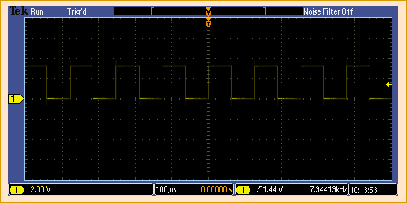
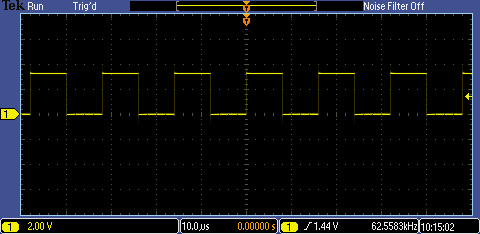
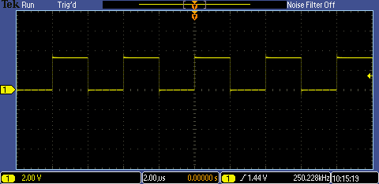
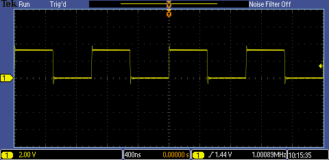
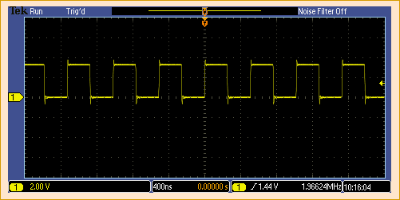
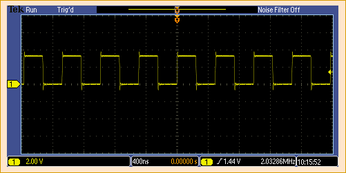
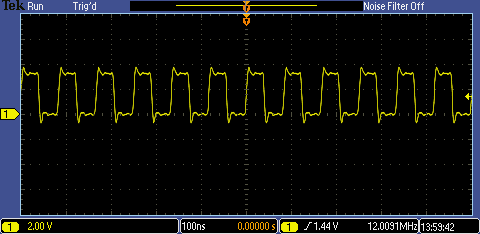
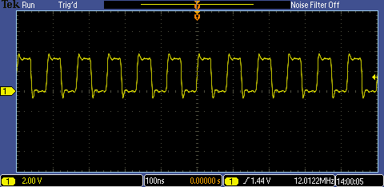

# PIC18FxxJ13 - Internal Oscillator.

## 0.Contents.

- [1.INTOSC (INTOSCO) - Internal Oscillator.](#1intosc-intosco---internal-oscillator)
- [2.INTOSCPLL (INTOSCPLLO) - 96MHz PLL Configuration Words.](#2intoscpll-intoscpllo---96mhz-configuration-words-pll)
- [3.INTOSCPLL (INTOSCPLLO) - 96MHz PLL Software.](#3intoscpll-intoscpllo---96mhz-software-pll)
- [4.INTOSCPLL (INTOSCPLLO) - 4xPLL Configuration Words.](#4intoscpll-intoscpllo---4xpll-configuration-words)
- [5.INTOSCPLL (INTOSCPLLO) - 4xPLL Software.](#5intoscpll-intoscpllo---4xpll-software)

## 1.INTOSC (INTOSCO) - Internal Oscillator.

```c
// Configuration Registers.
#pragma config WDTEN=OFF, PLLDIV=1, CFGPLLEN=OFF, STVREN=ON, XINST=OFF
#pragma config CP0=OFF, OSC=INTOSCO, SOSCSEL=HIGH, CLKOEC=ON, FCMEN=OFF
#pragma config IESO=OFF, WDTPS=32768, DSWDTOSC=INTOSCREF, RTCOSC=T1OSCREF
#pragma config DSBOREN=ON, DSWDTEN=ON, DSWDTPS=G2
#pragma config IOL1WAY=ON, ADCSEL=BIT10, PLLSEL=PLL4X, MSSP7B_EN=MSK7
#pragma config WPFP=PAGE_63, WPCFG=OFF, WPDIS=OFF, WPEND=PAGE_WPFP

#include <xc.h>
// PIC18FxxJ13 - Compile with XC8(v2.31).
// PIC18FxxJ13 - @xMHz Internal Oscillator.
// v0.1 - 06/2020.

// Internal Clock Source.
// Clock Out Enable on RA6.

// MCU.RA6 -> SCOPE.PROBE.A.

// PIC8-Bit Nano Trainer.
// SDA - Open.
// SCL - Open.

// PIC8-Bit Mini Trainer.
// URX - Open.
// UTX - Open.
// SDA - Open.
// SCL - Open.
// VCAP - Close.
// BCKL - Open.

// PIC8-Bit Trainer.
// SDA - Open.
// SCL - Open.
// VEE - Open.
// BCKL - Open.
// VCAP - Close.
// SPI/I2C - Open.

// Main.
int main(void)
{
    // MCU Initialization.
    // Oscillator Settings.
    // IRCF - Internal Oscillator Frequency.
    // IRCF2.0 = 1 1 1 - 8MHz.
    // IRCF2.0 = 1 1 0 - 4MHz.
    // IRCF2.0 = 1 0 1 - 2MHz.
    // IRCF2.0 = 1 0 0 - 1MHz.
    // IRCF2.0 = 0 1 1 - 500kHz.
    // IRCF2.0 = 0 1 0 - 250kHz.
    // IRCF2.0 = 0 0 1 - 125kHz.
    // IRCF2.0 = 0 0 0 - 31kHz.
    OSCCONbits.IRCF = 0b000;
    // SCS - System Clock.
    // SCS1.0 = 1 1 - Postscaled Internal Oscillator.
    // SCS1.0 = 0 1 - Timer1 Oscillator.
    // SCS1.0 = 0 0 - Primary Clock Source.
    OSCCONbits.SCS = 0b00;
    // INTSRC - Internal Oscillator Low-Frequency.
    // INTSRC0 = 1 - 31.25kHz Clock From Internal 8MHz INTOSC Oscillator.
    // INTSRC0 = 0 - 31kHz Clock From Internal INTSRC Oscillator.
    OSCTUNEbits.INTSRC = 0b0;
    // OSCTUNE - Oscillator Tuning.
    // OSCTUNE5.0 = 0 1 1 1 1 1 - Maximum Frequency.
    //...
    // OSCTUNE5.0 = 0 0 0 0 0 0 - Factory Calibrated Frequency.
    // ...
    // OSCTUNE5.0 = 1 0 0 0 0 0 - Minimum Frequency.
    OSCTUNEbits.TUN = 0b000000;
    // REFOCON - Reference Oscillator.
    // REFOCON0 = 1 - REFOCON Enable.
    // REFOCON0 = 0 - REFOCON Disable.
    REFOCONbits.ROON = 0b0;

    while(1){
    }
    return(0);
}
```

- FOSC=31kHz, INTSCR=1, IRCF=000, OSCTUNE=100000.

<p align="center"></p>

- FOSC=31kHz, INTSCR=1, IRCF=000, OSCTUNE=000000.

<p align="center"></p>

- FOSC=31kHz, INTSCR=1, IRCF=000, OSCTUNE=011111.

<p align="center"></p>

- FOSC=31.25kHz, INTSCR=0, IRCF=000, OSCTUNE=000000.

<p align="center"></p>

- FOSC=125kHz, INTSCR=0, IRCF=001, OSCTUNE=000000.

<p align="center"></p>

- FOSC=250kHz, INTSCR=0, IRCF=010, OSCTUNE=000000.

<p align="center"></p>

- FOSC=500kHz, INTSCR=0, IRCF=011, OSCTUNE=000000.

<p align="center"></p>

- FOSC=1MHz, INTSCR=0, IRCF=100, OSCTUNE=000000.

<p align="center"></p>

- FOSC=2MHz, INTSCR=0, IRCF=101, OSCTUNE=000000.

<p align="center"></p>

- FOSC=4MHz, INTSCR=0, IRCF=110, OSCTUNE=000000.

<p align="center"></p>

- FOSC=8MHz, INTSCR=0, IRCF=111, OSCTUNE=100000.

<p align="center"></p>

- FOSC=8MHz, INTSCR=0, IRCF=111, OSCTUNE=000000.

<p align="center"></p>

- FOSC=8MHz, INTSCR=0, IRCF=111, OSCTUNE=011111.

<p align="center"></p>

## 2.INTOSCPLL (INTOSCPLLO) - 96MHz Configuration Words PLL.

```c
// Configuration Registers.
#pragma config WDTEN=OFF, PLLDIV=2, CFGPLLEN=ON, STVREN=ON, XINST=OFF
#pragma config CP0=OFF, OSC=INTOSCPLLO, SOSCSEL=HIGH, CLKOEC=ON, FCMEN=OFF
#pragma config IESO=OFF, WDTPS=32768, DSWDTOSC=INTOSCREF, RTCOSC=T1OSCREF
#pragma config DSBOREN=ON, DSWDTEN=ON, DSWDTPS=G2
#pragma config IOL1WAY=ON, ADCSEL=BIT10, PLLSEL=PLL96, MSSP7B_EN=MSK7
#pragma config WPFP=PAGE_63, WPCFG=OFF, WPDIS=OFF, WPEND=PAGE_WPFP

#include <xc.h>
// PIC18FxxJ13 - Compile with XC8(v2.31).
// PIC18FxxJ13 - @xMHz Internal Oscillator.

// Internal Clock Source.
// Clock Out Enable on RA6.

// MCU.RA6 -> SCOPE.PROBE.A.

// PIC8-Bit Nano Trainer.
// SDA - Open.
// SCL - Open.

// PIC8-Bit Mini Trainer.
// URX - Open.
// UTX - Open.
// SDA - Open.
// SCL - Open.
// VCAP - Close.
// BCKL - Open.

// PIC8-Bit Trainer.
// SDA - Open.
// SCL - Open.
// VEE - Open.
// BCKL - Open.
// VCAP - Close.
// SPI/I2C - Open.

// Main.
int main(void)
{
    // MCU Initialization.
    // Oscillator Settings.
    // IRCF - Internal Oscillator Frequency.
    // IRCF2.0 = 1 1 1 - 8MHz.
    // IRCF2.0 = 1 1 0 - 4MHz.
    // IRCF2.0 = 1 0 1 - 2MHz.
    // IRCF2.0 = 1 0 0 - 1MHz.
    // IRCF2.0 = 0 1 1 - 500kHz.
    // IRCF2.0 = 0 1 0 - 250kHz.
    // IRCF2.0 = 0 0 1 - 125kHz.
    // IRCF2.0 = 0 0 0 - 31kHz.
    OSCCONbits.IRCF = 0b111;
    // SCS - System Clock.
    // SCS1.0 = 1 1 - Postscaled Internal Oscillator.
    // SCS1.0 = 0 1 - Timer1 Oscillator.
    // SCS1.0 = 0 0 - Primary Clock Source.
    OSCCONbits.SCS = 0b00;
    // PLLEN - Software PLL.
    // PLLEN0 = 1 - PLL Enable.
    // PLLEN0 = 0 - PLL Disable.
    OSCTUNEbits.PLLEN = 0b0;
    // INTSRC - Internal Oscillator Low-Frequency.
    // INTSRC0 = 1 - 31.25kHz Clock From Internal 8MHz INTOSC Oscillator.
    // INTSRC0 = 0 - 31kHz Clock From Internal INTSRC Oscillator.
    OSCTUNEbits.INTSRC = 0b0;
    // OSCTUNE - Oscillator Tuning.
    // OSCTUNE5.0 = 0 1 1 1 1 1 - Maximum Frequency.
    //...
    // OSCTUNE5.0 = 0 0 0 0 0 0 - Factory Calibrated Frequency.
    // ...
    // OSCTUNE5.0 = 1 0 0 0 0 0 - Minimum Frequency.
    OSCTUNEbits.TUN = 0b000000;
    // REFOCON - Reference Oscillator.
    // REFOCON0 = 1 - REFOCON Enable.
    // REFOCON0 = 0 - REFOCON Disable.
    REFOCONbits.ROON = 0b0;

    while(1){
    }
    return(0);
}
```

- FOSC=48MHz, PLLDIV=2, CFGPLLEN=ON, PLLSEL=PLL96.

<p align="center"></p>

## 3.INTOSCPLL (INTOSCPLLO) - 96MHz Software PLL.

```c
// Configuration Registers.
#pragma config WDTEN=OFF, PLLDIV=2, CFGPLLEN=OFF, STVREN=ON, XINST=OFF
#pragma config CP0=OFF, OSC=INTOSCPLLO, SOSCSEL=HIGH, CLKOEC=ON, FCMEN=OFF
#pragma config IESO=OFF, WDTPS=32768, DSWDTOSC=INTOSCREF, RTCOSC=T1OSCREF
#pragma config DSBOREN=ON, DSWDTEN=ON, DSWDTPS=G2
#pragma config IOL1WAY=ON, ADCSEL=BIT10, PLLSEL=PLL96, MSSP7B_EN=MSK7
#pragma config WPFP=PAGE_63, WPCFG=OFF, WPDIS=OFF, WPEND=PAGE_WPFP

#include <xc.h>
// PIC18FxxJ13 - Compile with XC8(v2.31).
// PIC18FxxJ13 - @xMHz Internal Oscillator.

// Internal Clock Source.
// Clock Out Enable on RA6.

// MCU.RA6 -> SCOPE.PROBE.A.

// PIC8-Bit Nano Trainer.
// SDA - Open.
// SCL - Open.

// PIC8-Bit Mini Trainer.
// URX - Open.
// UTX - Open.
// SDA - Open.
// SCL - Open.
// VCAP - Close.
// BCKL - Open.

// PIC8-Bit Trainer.
// SDA - Open.
// SCL - Open.
// VEE - Open.
// BCKL - Open.
// VCAP - Close.
// SPI/I2C - Open.

// Main.
int main(void)
{
    // MCU Initialization.
    // Oscillator Settings.
    // IRCF - Internal Oscillator Frequency.
    // IRCF2.0 = 1 1 1 - 8MHz.
    // IRCF2.0 = 1 1 0 - 4MHz.
    // IRCF2.0 = 1 0 1 - 2MHz.
    // IRCF2.0 = 1 0 0 - 1MHz.
    // IRCF2.0 = 0 1 1 - 500kHz.
    // IRCF2.0 = 0 1 0 - 250kHz.
    // IRCF2.0 = 0 0 1 - 125kHz.
    // IRCF2.0 = 0 0 0 - 31kHz.
    OSCCONbits.IRCF = 0b111;
    // SCS - System Clock.
    // SCS1.0 = 1 1 - Postscaled Internal Oscillator.
    // SCS1.0 = 0 1 - Timer1 Oscillator.
    // SCS1.0 = 0 0 - Primary Clock Source.
    OSCCONbits.SCS = 0b00;
    // PLLEN - Software PLL.
    // PLLEN0 = 1 - PLL Enable.
    // PLLEN0 = 0 - PLL Disable.
    OSCTUNEbits.PLLEN = 0b0;
    // INTSRC - Internal Oscillator Low-Frequency.
    // INTSRC0 = 1 - 31.25kHz Clock From Internal 8MHz INTOSC Oscillator.
    // INTSRC0 = 0 - 31kHz Clock From Internal INTSRC Oscillator.
    OSCTUNEbits.INTSRC = 0b0;
    // OSCTUNE - Oscillator Tuning.
    // OSCTUNE5.0 = 0 1 1 1 1 1 - Maximum Frequency.
    //...
    // OSCTUNE5.0 = 0 0 0 0 0 0 - Factory Calibrated Frequency.
    // ...
    // OSCTUNE5.0 = 1 0 0 0 0 0 - Minimum Frequency.
    OSCTUNEbits.TUN = 0b000000;
    // REFOCON - Reference Oscillator.
    // REFOCON0 = 1 - REFOCON Enable.
    // REFOCON0 = 0 - REFOCON Disable.
    REFOCONbits.ROON = 0b0;

    while(1){
    }
    return(0);
}
```

- FOSC=8MHz, PLLEN=0, PLLDIV=2, CFGPLLEN=OFF, PLLSEL=PLL96.

<p align="center"></p>

- FOSC=48MHz, PLLEN=1, PLLDIV=2, CFGPLLEN=OFF, PLLSEL=PLL96.

<p align="center"></p>

## 4.INTOSCPLL (INTOSCPLLO) - 4xPLL Configuration Words.

```c
// Configuration Registers.
#pragma config WDTEN=OFF, PLLDIV=1, CFGPLLEN=ON, STVREN=ON, XINST=OFF
#pragma config CP0=OFF, OSC=INTOSCPLLO, SOSCSEL=HIGH, CLKOEC=ON, FCMEN=OFF
#pragma config IESO=OFF, WDTPS=32768, DSWDTOSC=INTOSCREF, RTCOSC=T1OSCREF
#pragma config DSBOREN=ON, DSWDTEN=ON, DSWDTPS=G2
#pragma config IOL1WAY=ON, ADCSEL=BIT10, PLLSEL=PLL4X, MSSP7B_EN=MSK7
#pragma config WPFP=PAGE_63, WPCFG=OFF, WPDIS=OFF, WPEND=PAGE_WPFP

#include <xc.h>
// PIC18FxxJ13 - Compile with XC8(v2.31).
// PIC18FxxJ13 - @xMHz Internal Oscillator.

// Internal Clock Source.
// Clock Out Enable on RA6.

// MCU.RA6 -> SCOPE.PROBE.A.

// PIC8-Bit Nano Trainer.
// SDA - Open.
// SCL - Open.

// PIC8-Bit Mini Trainer.
// URX - Open.
// UTX - Open.
// SDA - Open.
// SCL - Open.
// VCAP - Close.
// BCKL - Open.

// PIC8-Bit Trainer.
// SDA - Open.
// SCL - Open.
// VEE - Open.
// BCKL - Open.
// VCAP - Close.
// SPI/I2C - Open.

// Main.
int main(void)
{
    // MCU Initialization.
    // Oscillator Settings.
    // IRCF - Internal Oscillator Frequency.
    // IRCF2.0 = 1 1 1 - 8MHz.
    // IRCF2.0 = 1 1 0 - 4MHz.
    // IRCF2.0 = 1 0 1 - 2MHz.
    // IRCF2.0 = 1 0 0 - 1MHz.
    // IRCF2.0 = 0 1 1 - 500kHz.
    // IRCF2.0 = 0 1 0 - 250kHz.
    // IRCF2.0 = 0 0 1 - 125kHz.
    // IRCF2.0 = 0 0 0 - 31kHz.
    OSCCONbits.IRCF = 0b110;
    // SCS - System Clock.
    // SCS1.0 = 1 1 - Postscaled Internal Oscillator.
    // SCS1.0 = 0 1 - Timer1 Oscillator.
    // SCS1.0 = 0 0 - Primary Clock Source.
    OSCCONbits.SCS = 0b00;
    // PLLEN - Software PLL.
    // PLLEN0 = 1 - PLL Enable.
    // PLLEN0 = 0 - PLL Disable.
    OSCTUNEbits.PLLEN = 0b0;
    // INTSRC - Internal Oscillator Low-Frequency.
    // INTSRC0 = 1 - 31.25kHz Clock From Internal 8MHz INTOSC Oscillator.
    // INTSRC0 = 0 - 31kHz Clock From Internal INTSRC Oscillator.
    OSCTUNEbits.INTSRC = 0b0;
    // OSCTUNE - Oscillator Tuning.
    // OSCTUNE5.0 = 0 1 1 1 1 1 - Maximum Frequency.
    //...
    // OSCTUNE5.0 = 0 0 0 0 0 0 - Factory Calibrated Frequency.
    // ...
    // OSCTUNE5.0 = 1 0 0 0 0 0 - Minimum Frequency.
    OSCTUNEbits.TUN = 0b000000;
    // REFOCON - Reference Oscillator.
    // REFOCON0 = 1 - REFOCON Enable.
    // REFOCON0 = 0 - REFOCON Disable.
    REFOCONbits.ROON = 0b0;

    while(1){
    }
    return(0);
}
```

- FOSC=16MHz, PLLDIV=1, CFGPLLEN=ON, PLLSEL=PLL4X.

<p align="center"></p>

- FOSC=32MHz, PLLDIV=1, CFGPLLEN=ON, PLLSEL=PLL4X.

<p align="center"></p>

## 5.INTOSCPLL (INTOSCPLLO) - 4xPLL Software.

```c
// Configuration Registers.
#pragma config WDTEN=OFF, PLLDIV=1, CFGPLLEN=OFF, STVREN=ON, XINST=OFF
#pragma config CP0=OFF, OSC=INTOSCPLLO, SOSCSEL=HIGH, CLKOEC=ON, FCMEN=OFF
#pragma config IESO=OFF, WDTPS=32768, DSWDTOSC=INTOSCREF, RTCOSC=T1OSCREF
#pragma config DSBOREN=ON, DSWDTEN=ON, DSWDTPS=G2
#pragma config IOL1WAY=ON, ADCSEL=BIT10, PLLSEL=PLL4X, MSSP7B_EN=MSK7
#pragma config WPFP=PAGE_63, WPCFG=OFF, WPDIS=OFF, WPEND=PAGE_WPFP

#include <xc.h>
// PIC18FxxJ13 - Compile with XC8(v2.31).
// PIC18FxxJ13 - @xMHz Internal Oscillator.

// Internal Clock Source.
// Clock Out Enable on RA6.

// MCU.RA6 -> SCOPE.PROBE.A.

// PIC8-Bit Nano Trainer.
// SDA - Open.
// SCL - Open.

// PIC8-Bit Mini Trainer.
// URX - Open.
// UTX - Open.
// SDA - Open.
// SCL - Open.
// VCAP - Close.
// BCKL - Open.

// PIC8-Bit Trainer.
// SDA - Open.
// SCL - Open.
// VEE - Open.
// BCKL - Open.
// VCAP - Close.
// SPI/I2C - Open.

// Main.
int main(void)
{
    // MCU Initialization.
    // Oscillator Settings.
    // IRCF - Internal Oscillator Frequency.
    // IRCF2.0 = 1 1 1 - 8MHz.
    // IRCF2.0 = 1 1 0 - 4MHz.
    // IRCF2.0 = 1 0 1 - 2MHz.
    // IRCF2.0 = 1 0 0 - 1MHz.
    // IRCF2.0 = 0 1 1 - 500kHz.
    // IRCF2.0 = 0 1 0 - 250kHz.
    // IRCF2.0 = 0 0 1 - 125kHz.
    // IRCF2.0 = 0 0 0 - 31kHz.
    OSCCONbits.IRCF = 0b110;
    // SCS - System Clock.
    // SCS1.0 = 1 1 - Postscaled Internal Oscillator.
    // SCS1.0 = 0 1 - Timer1 Oscillator.
    // SCS1.0 = 0 0 - Primary Clock Source.
    OSCCONbits.SCS = 0b00;
    // PLLEN - Software PLL.
    // PLLEN0 = 1 - PLL Enable.
    // PLLEN0 = 0 - PLL Disable.
    OSCTUNEbits.PLLEN = 0b1;
    // INTSRC - Internal Oscillator Low-Frequency.
    // INTSRC0 = 1 - 31.25kHz Clock From Internal 8MHz INTOSC Oscillator.
    // INTSRC0 = 0 - 31kHz Clock From Internal INTSRC Oscillator.
    OSCTUNEbits.INTSRC = 0b0;
    // OSCTUNE - Oscillator Tuning.
    // OSCTUNE5.0 = 0 1 1 1 1 1 - Maximum Frequency.
    //...
    // OSCTUNE5.0 = 0 0 0 0 0 0 - Factory Calibrated Frequency.
    // ...
    // OSCTUNE5.0 = 1 0 0 0 0 0 - Minimum Frequency.
    OSCTUNEbits.TUN = 0b000000;
    // REFOCON - Reference Oscillator.
    // REFOCON0 = 1 - REFOCON Enable.
    // REFOCON0 = 0 - REFOCON Disable.
    REFOCONbits.ROON = 0b0;

    while(1){
    }
    return(0);
}
```

- FOSC=16MHz, PLLDIV=1, CFGPLLEN=OFF, PLLSEL=PLL4X.

<p align="center"></p>

- FOSC=32MHz, PLLEN=1, PLLDIV=1, CFGPLLEN=OFF, PLLSEL=PLL4X.

<p align="center"></p>

---
DISCLAIMER: THIS CODE IS PROVIDED WITHOUT ANY WARRANTY OR GUARANTEES.
USERS MAY USE THIS CODE FOR DEVELOPMENT AND EXAMPLE PURPOSES ONLY.
AUTHORS ARE NOT RESPONSIBLE FOR ANY ERRORS, OMISSIONS, OR DAMAGES THAT COULD
RESULT FROM USING THIS FIRMWARE IN WHOLE OR IN PART.