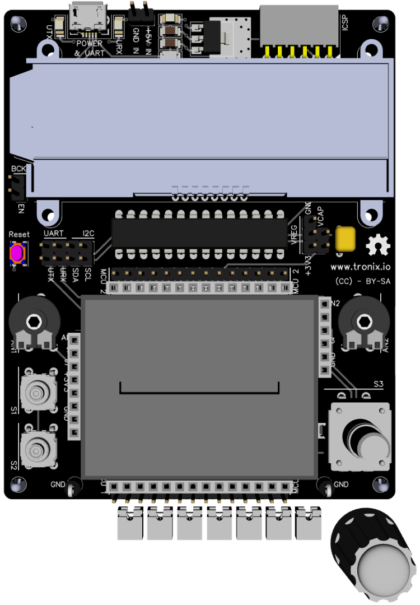

# PIC16-Bit Mini Trainer.

## Features.

- 28 Pins PIC16-Bit Family (dsPIC33/PIC24).
- Powered with micro USB or 5V external power supply, regulated at 3V3.
- Internal oscillator.
- Headers for breadboard and probes.
- LCD 2x20 I2C with backlight.
- I2C with jumpers.
- UART MCP2221A with jumpers.
- 170 Tie-Point breadboard.
- PCB 80x100mm.

## Schematic.

- [PIC16-Bit Mini Trainer.](./pic16bit-mini.pdf)

## Code Examples.

- [PIC16-Bit Features.](https://github.com/tronixio/trainer-boards/tree/main/boards/16bit-features)
- [PIC24FJ64GA002 - ADC - EUSART - LCD - ROTARY ENCODER - SWITCHS.](./pic24fjxxga002-mini.md)

## Jumpers Configuration.

|PIC           |VREG|VCAP |
|--------------|:--:|:---:|
|PIC24FJ64GA002|GND |Close|

## Board top.

## Board bottom.

---