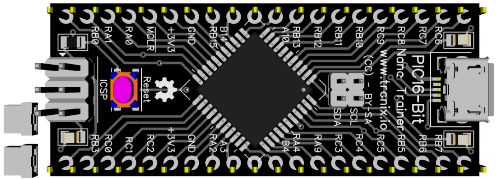
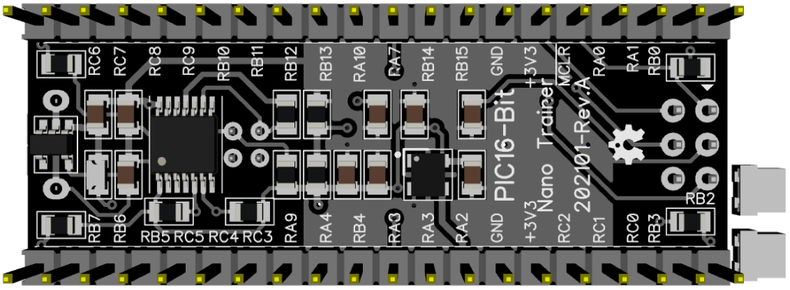

# PIC16-Bit Nano Trainer.

## Features.

- 44 Pins PIC16-Bit Family (dsPIC33/PIC24).
- Powered with micro USB, regulated at 3V3.
- Oscillator internal or external MEMS.
- Headers for breadboard and probes.
- I2C with jumpers.
- UART MCP2221A.
- PCB 21x52mm.

## Schematic.

- [PIC16-Bit Nano Trainer.](./pic16bit-nano.pdf)

## Code Examples.

- [PIC16-Bit Features.](https://github.com/tronixio/trainer-boards/tree/main/boards/16bit-features)

## Jumpers & Capacitor Configuration.

|PIC           |JP1 - VREG +3V3|JP2 - VREG GND|VCAP    |
|--------------|:-------------:|:------------:|:------:|
|PIC24FJ64GA004|Open           |Close         |Populate|

## Board top.

## Board bottom.

---