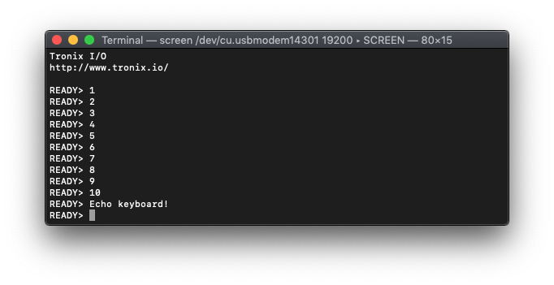

# PIC16-Bit Nano Trainer.

## 0.Contents.

- [1.EUSART Asynchronous.](#1eusart-asynchronous)

## 1.EUSART Asynchronous.

```c
// Configuration Registers.
#pragma config POSCMOD = EC, I2C1SEL = PRI, IOL1WAY = ON, OSCIOFNC = ON
#pragma config FCKSM = CSDCMD, FNOSC = PRI, SOSCSEL = SOSC, WUTSEL = LEG
#pragma config IESO = OFF, WDTPS = PS32768, FWPSA = PR128, WINDIS = OFF
#pragma config FWDTEN = OFF, ICS = PGx1, GWRP = OFF, GCP = OFF, JTAGEN = OFF

#define FOSC    (24576000UL)
#define FCY     (FOSC/2)

#include <xc.h>
// PIC24FJxxGA004 - Compile with XC16(v1.50).
// PIC24FJxxGA004 - @24.576MHz External Oscillator.
// v0.1 - 07/2020.

// PIC16-Bit Nano Trainer.
// 1x EUSART ASYNCHRONOUS TX/RX.

// Jumpers.
// SDA - Open.
// SCL - Open.

// Definitions.
// EUSART.
#define BAUDRATE                    19200
#define BAUDRATE_GENERATOR_BRGH_0   (((FCY/BAUDRATE)/16)-1)
#define BAUDRATE_GENERATOR_BRGH_1   (((FCY/BAUDRATE)/4)-1)
// ASCII Characters.
#define ASCII_CR                    0x0D

// Function Prototypes.
uint8_t eusart_readCharacter(void);
void eusart_writeCharacter(uint8_t u8Data);
void eusart_writeString(const uint8_t * u8Data);
void u16toa(uint16_t u16Data, uint8_t * u8Buffer, uint8_t u8Base);

// Strings.
const uint8_t au8Tronix[] = "\r\n\r\nTronix I/O";
const uint8_t au8WWW[] = "\r\nhttp://www.tronix.io/\r\n";
const uint8_t au8Ready[] = "\r\nREADY> ";

// Main.
void main(void)
{
    // MCU Initialization.
    // Ports Initialization.
    // Analog Inputs Settings.
    AD1PCFG = 0b1001111000111111;
    // Port A Settings.
    TRISA = 0b0000000000000000;
    PORTA = 0b0000000000000000;
    LATA = 0b0000000000000000;
    ODCA = 0b0000000000000000;
    // Port B Settings.
    TRISB = 0b0000000000100000;
    PORTB = 0b0000000000000000;
    LATB = 0b0000000000000000;
    ODCB = 0b0000000000000000;
    // Port B Settings.
    TRISC = 0b0000000000000000;
    PORTC = 0b0000000000000000;
    LATC = 0b0000000000000000;
    ODCC = 0b0000000000000000;
    // PPS Settings.
    __builtin_write_OSCCONL(OSCCON & 0xBF);
    // PPS Inputs.
    RPINR18bits.U1RXR = 0b00101;    // RB5 - RP5 - EUSART.U1RX.
    // PPS Outputs.
    RPOR3bits.RP6R = 0b00011;       // RB6 - RP6 - EUSART.U1TX.
    __builtin_write_OSCCONL(OSCCON | 0x40);

    // EUSART Settings.
    U1MODE = 0x0000;
    U1STA = 0x0000;
    U1TXREG = 0;
    U1RXREG = 0;
    U1BRG = BAUDRATE_GENERATOR_BRGH_0;
    // UART Enable.
    U1MODEbits.UARTEN = 0b1;
    U1STAbits.UTXEN = 0b1;

    // Display String.
    eusart_writeString(au8Tronix);
    eusart_writeString(au8WWW);

    uint8_t u8Tx, buffer[6];
    for(u8Tx=1; u8Tx<=10; u8Tx++){
        u16toa(u8Tx, buffer, 10);
        eusart_writeString(au8Ready);
        eusart_writeString(buffer);
    }
    eusart_writeString(au8Ready);

    uint8_t u8Rx;
    while(1){
        if(IFS0bits.U1RXIF){
            u8Rx = eusart_readCharacter();
            eusart_writeCharacter(u8Rx);
            if(u8Rx == ASCII_CR)
                eusart_writeString(au8Ready);
        }
    }
}

// Functions.
uint8_t eusart_readCharacter(void)
{
    if(U1STAbits.OERR)
        U1STAbits.OERR = 0b0;

    while(!U1STAbits.URXDA){};
    return(U1RXREG);
}

void eusart_writeCharacter(uint8_t u8Data)
{
    while(U1STAbits.UTXBF){};
    U1TXREG = u8Data;
}

void eusart_writeString(const uint8_t * u8Data)
{
    while(*u8Data != '\0')
        eusart_writeCharacter(*u8Data++);
}

void u16toa(uint16_t u16Data, uint8_t * u8Buffer, uint8_t u8Base)
{
    uint8_t buffer;
    uint16_t data = u16Data;

    while(data != '\0'){
        data /= u8Base;
        u8Buffer++;
    }
    *u8Buffer-- = 0;

    while(u16Data != '\0'){
        buffer = u16Data % u8Base;
        u16Data /= u8Base;
        if(buffer >= 10)
            buffer += 'A' - '0' - 10;
        buffer += '0';
        *u8Buffer-- = buffer;
    }
}
```

<p align="center"></p>

---
DISCLAIMER: THIS CODE IS PROVIDED WITHOUT ANY WARRANTY OR GUARANTEES.
USERS MAY USE THIS CODE FOR DEVELOPMENT AND EXAMPLE PURPOSES ONLY.
AUTHORS ARE NOT RESPONSIBLE FOR ANY ERRORS, OMISSIONS, OR DAMAGES THAT COULD
RESULT FROM USING THIS IN WHOLE OR IN PART.