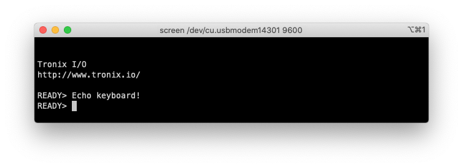

# DRAFT - PIC16-Bit Nano Trainer.

## 0.Contents.

- [1.PIC24FJxxGA004 - EUSART Rx/Tx Asynchronous - Internal Oscillator.](#)
- [2.PIC24FJxxGA004 - EUSART Rx/Tx Asynchronous - External MEMS.](#)

## 1.PIC24FJxxGA004 - EUSART Rx/Tx Asynchronous - Internal Oscillator.

```c

```

<p align="center"></p>

## 2.PIC24FJxxGA004 - EUSART Rx/Tx Asynchronous - External MEMS.

```c

```

<p align="center"></p>

---
DISCLAIMER: THIS CODE IS PROVIDED WITHOUT ANY WARRANTY OR GUARANTEES.
USERS MAY USE THIS CODE FOR DEVELOPMENT AND EXAMPLE PURPOSES ONLY.
AUTHORS ARE NOT RESPONSIBLE FOR ANY ERRORS, OMISSIONS, OR DAMAGES THAT COULD
RESULT FROM USING THIS FIRMWARE IN WHOLE OR IN PART.