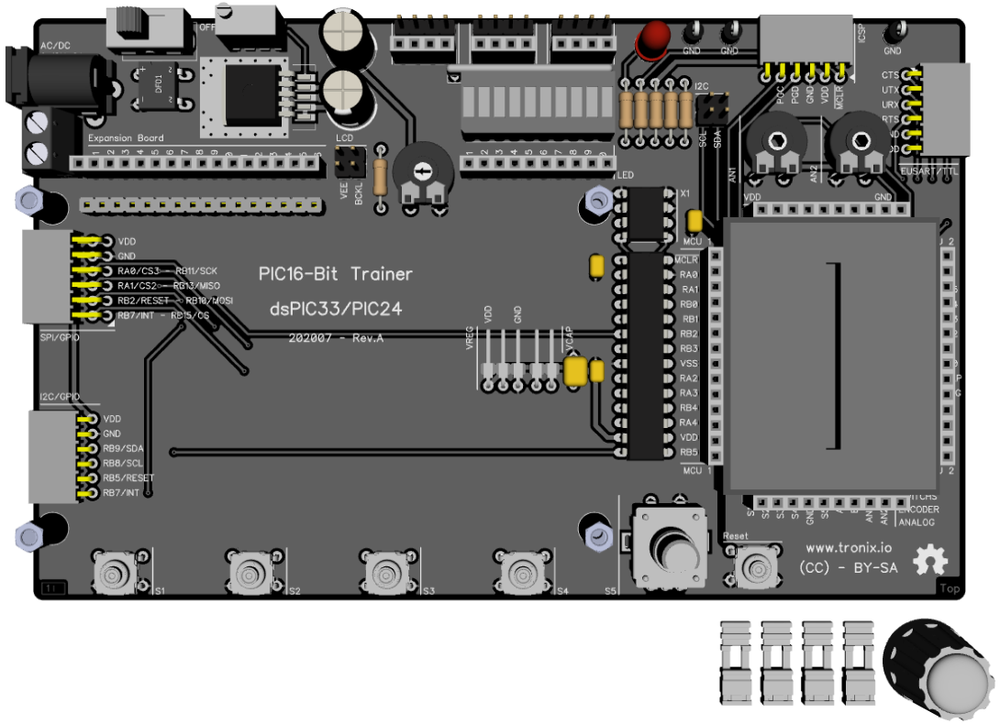
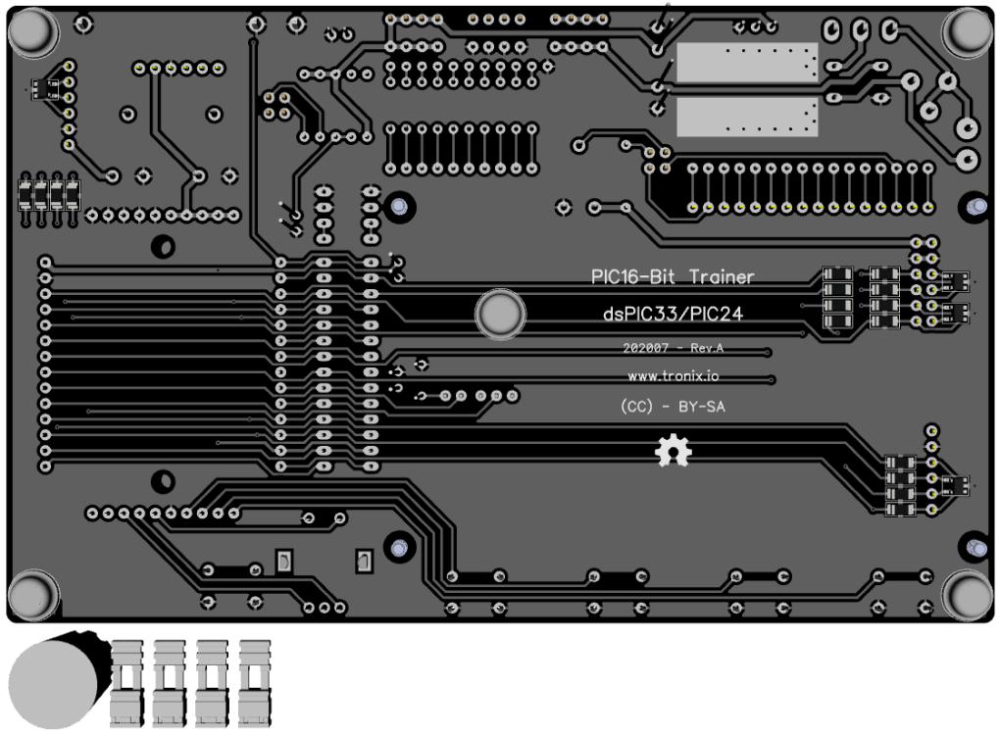

# PIC16-Bit Trainer.

## Features.

- 28 Pins PIC16-Bit Family (dsPIC33/PIC24).
- Powered with external DC or AC, variable regulated.
- Internal oscillator and/or external oscillator.
- Headers for breadboard and probes.
- I2C with jumpers.
- PCB 160x100mm.

## Schematic.

- [PIC16-Bit Trainer.](./pic16bit-trainer.pdf)

## Code Examples.

- [DRAFT - PIC24FJ64GA002 - ADC - BARGRAPH - ROTARY ENCODER.](./pic24fjxxga002-trainer.md)

## Jumpers Configuration.

|PIC           |VREG|VCAP |
|--------------|:--:|:---:|
|PIC24FJ64GA002|GND |Close|

## Board top.

## Board bottom.

---