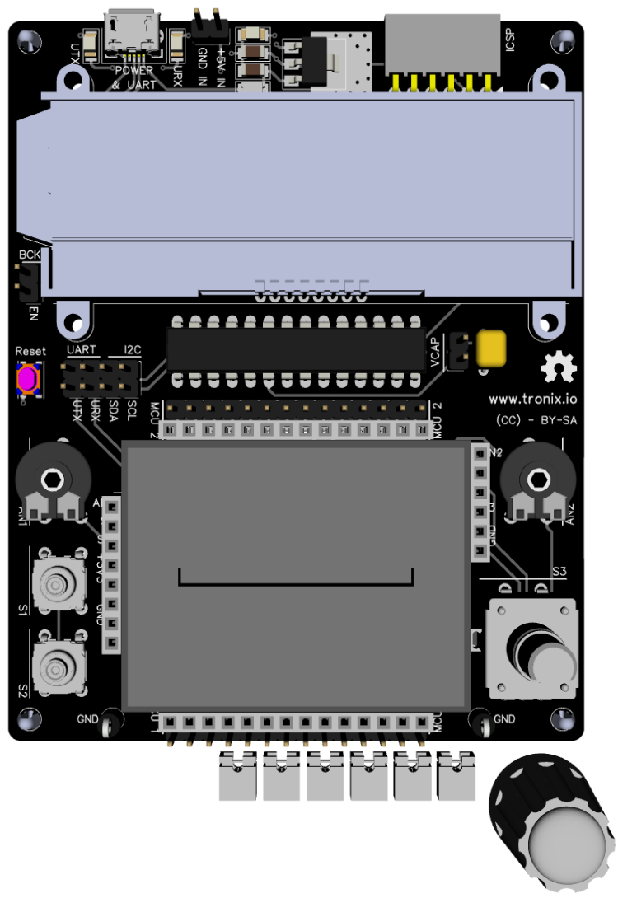
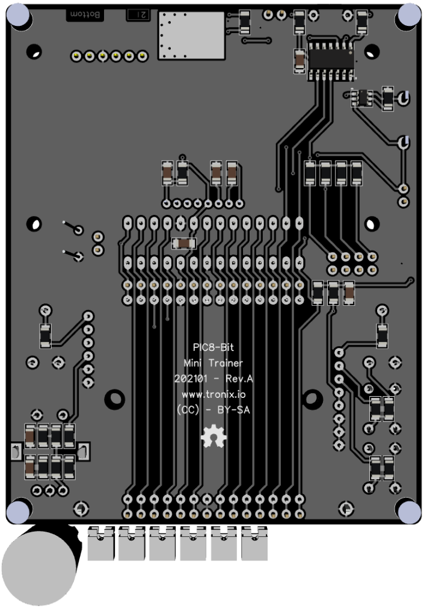

# PIC8-Bit Mini Trainer.

## Features.

- 28 Pins PIC8-Bit Family (PIC16F/PIC18F).
- Powered with micro USB or 5V external power supply, regulated at 3V3.
- Internal oscillator.
- Headers for breadbord and probes.
- LCD 2x20 I2C with backlight.
- I2C with jumpers.
- UART MCP2221A with jumpers.
- 170 Tie-Point breadboard.
- PCB 80x100mm.

## Schematic.

- [PIC8-Bit Mini Trainer.](./pic8bit-mini.pdf)

## Code Examples.

- [PIC16F1773/6/8 - ADC - EUSART - LCD - ROTARY ENCODER - SWITCHS.](./pic16f1778-mini.md)

## Jumper Configuration.

|PIC           |VCAP |
|--------------|-----|
|PIC16F1773/6/8|Open |
|PIC18F2xJ13   |Close|
|PIC18F4xQ43   |Open |

## Board top.

## Board bottom.

---