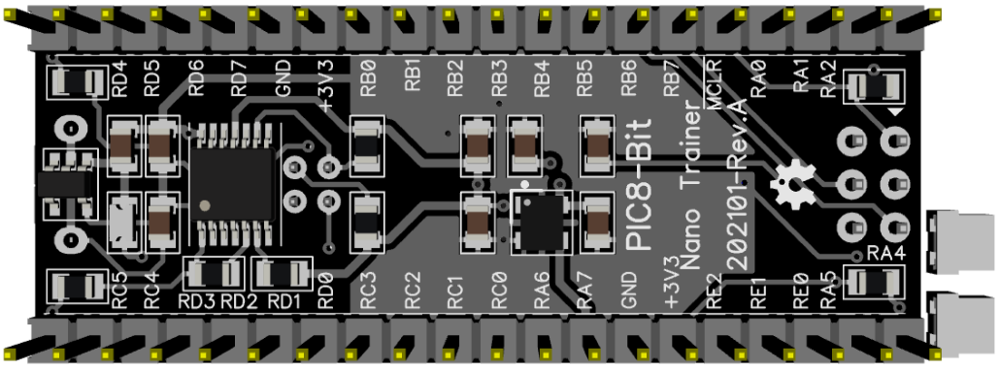

# PIC8-Bit Nano Trainer.

## Features.

- 44 Pins PIC8-Bit Family (PIC16F/PIC18F).
- Powered with micro USB, regulated at 3V3.
- Oscillator internal or external MEMS.
- Headers for breadboard and probes.
- I2C with jumpers.
- UART MCP2221A.
- PCB 21x52mm.

## Schematic.

- [PIC8-Bit Nano Trainer.](./pic8bit-nano.pdf)

## Code Examples.

- [PIC8-Bit Features.](https://github.com/tronixio/trainer-boards/tree/main/boards/8bit-features)
- [PIC16F1777/9 - EUSART.](./pic16f177x-nano.md)

## Capacitor Configuration.

|PIC         |VCAP           |
|------------|---------------|
|PIC16F1777/9|Do Not Populate|
|PIC18F4xJ13 |Populate       |
|PIC18F4xQ43 |Do Not Populate|

## Board top.

## Board bottom.

---