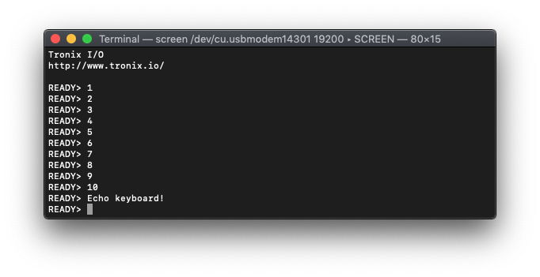

# PIC8-Bit Nano Trainer.

## 0.Contents.

- [1.EUSART Asynchronous.](#1eusart-asynchronous)

## 1.EUSART Asynchronous.

```c
// Configuration Registers.
#pragma config FOSC = ECH, WDTE = OFF, PWRTE = OFF, MCLRE = ON, CP = OFF
#pragma config BOREN = OFF, CLKOUTEN = ON, IESO = OFF, FCMEN = OFF
#pragma config WRT = OFF, PPS1WAY = ON, ZCD = OFF, PLLEN = OFF
#pragma config STVREN = ON, BORV = LO, LPBOR = OFF, LVP = ON

#include <xc.h>
#include <stdint.h>
#define _XTAL_FREQ 24576000
// PIC16F1777/9 - Compile with XC8(v2.30).
// PIC16F1777/9 - @24.576MHz External Oscillator.
// v0.1 - 07/2020.

// PIC8-Bit Nano Trainer.
// 1x EUSART ASYNCHRONOUS TX/RX.

// Jumpers.
// SDA - Open.
// SCL - Open.

// Definitions.
#define BAUDRATE                           19200
#define BAUDRATE_GENERATOR_BRG16_0_BRGH_0  ((_XTAL_FREQ/BAUDRATE/64)-1)
#define BAUDRATE_GENERATOR_BRG16_0_BRGH_1  ((_XTAL_FREQ/BAUDRATE/16)-1)
#define BAUDRATE_GENERATOR_BRG16_1_BRGH_0  ((_XTAL_FREQ/BAUDRATE/16)-1)
#define BAUDRATE_GENERATOR_BRG16_1_BRGH_1  ((_XTAL_FREQ/BAUDRATE/4)-1)
#define ASCII_CR                           0x0D

// Functions Prototype.
uint8_t eusart_readCharacter(void);
void eusart_writeCharacter(uint8_t u8Data);
void eusart_writeString(const uint8_t * u8Data);
void u8toa(uint8_t u8Data, uint8_t * u8Buffer, uint8_t u8Base);

// Strings & Custom patterns.
const uint8_t au8Tronix[] = "\r\n\r\nTronix I/O";
const uint8_t au8WWW[] = "\r\nhttp://www.tronix.io/\r\n";
const uint8_t au8Ready[] = "\r\nREADY> ";

// Main.
void main(void)
{
    // MCU Initialization.
    // Ports Settings.
    // PORT Data Register.
    PORTA = 0b00000000;
    PORTB = 0b00000000;
    PORTC = 0b00000000;
    PORTD = 0b00000000;
    PORTE = 0b00000000;
    // TRIS Data Direction.
    TRISA = 0b00000000;
    TRISB = 0b00000000;
    TRISC = 0b10000000;
    TRISD = 0b00000000;
    TRISE = 0b00000000;
    // WPU Disable.
    OPTION_REGbits.nWPUEN = 0b1;
    // LATCH Outputs.
    LATA = 0b00000000;
    LATB = 0b00000000;
    LATC = 0b10000000;
    LATD = 0b00000000;
    LATE = 0b10000000;
    // ANSEL Analog.
    ANSELA = 0b00000000;
    ANSELB = 0b00000000;
    ANSELC = 0b00000000;
    ANSELD = 0b00000000;
    ANSELE = 0b00000000;
    // WPU Weak Pull-up.
    WPUA = 0b00000000;
    WPUB = 0b00000000;
    WPUC = 0b00000000;
    WPUD = 0b00000000;
    WPUE = 0b00000000;
    // ODCON Open-drain.
    ODCONA = 0b00000000;
    ODCONB = 0b00000000;
    ODCONC = 0b00000000;
    ODCOND = 0b00000000;
    ODCONE = 0b00000000;
    // SRLCON Slew Rate.
    SLRCONA = 0b11111111;
    SLRCONB = 0b11111111;
    SLRCONC = 0b11111111;
    SLRCOND = 0b11111111;
    SLRCONE = 0b11111111;
    // INLVL Input Level.
    INLVLA  = 0b00000000;
    INLVLB  = 0b00000000;
    INLVLC  = 0b00000000;
    INLVLD  = 0b00000000;
    // HIDRVB High Drive.
    HIDRVB  = 0b00000000;
    // PPS Settings.
    PPSLOCK = 0x55;
    PPSLOCK = 0xAA;
    PPSLOCKbits.PPSLOCKED = 0b0;
    // PPS Inputs.
    RXPPSbits.RXPPS = 0x17;    // RC7 - EUSART.URX.
    // PPS Outputs.
    RC6PPSbits.RC6PPS = 0x24;  // RC6 - EUSART.UTX.
    PPSLOCK = 0x55;
    PPSLOCK = 0xAA;
    PPSLOCKbits.PPSLOCKED = 0b1;

    // EUSART Settings.
    RC1REG = 0;
    TX1REG = 0;
    SP1BRG = BAUDRATE_GENERATOR_BRG16_0_BRGH_0;
    RC1STA = 0x10;
    TX1STA = 0x20;
    BAUD1CON = 0x00;
    // EUSART Enable.
    RC1STAbits.SPEN = 0b1;

    // Display Strings.
    eusart_writeString(au8Tronix);
    eusart_writeString(au8WWW);

    uint8_t u8Tx, buffer[4];
    for(u8Tx=1; u8Tx<=10; u8Tx++){
        u8toa(u8Tx, buffer, 10);
        eusart_writeString(au8Ready);
        eusart_writeString(buffer);
    }
    eusart_writeString(au8Ready);

    uint8_t u8Rx;
    while(1){
        if(PIR1bits.RCIF){
            u8Rx = eusart_readCharacter();
            eusart_writeCharacter(u8Rx);
            if(u8Rx == ASCII_CR)
               eusart_writeString(au8Ready);
        }
    }
}

// Functions.
uint8_t eusart_readCharacter(void)
{
    if(RC1STAbits.OERR){
        RC1STAbits.CREN = 0b0;
        RC1STAbits.CREN = 0b1;
    }

    while(!PIR1bits.RCIF){};
    return(RC1REG);
}

void eusart_writeCharacter(uint8_t u8Data)
{
    while(!PIR1bits.TXIF){};
    TX1REG = u8Data;
}

void eusart_writeString(const uint8_t * u8Data)
{
    while(*u8Data != '\0')
        eusart_writeCharacter(*u8Data++);
}

void u8toa(uint8_t u8Data, uint8_t * u8Buffer, uint8_t u8Base)
{
    uint8_t buffer;
    uint8_t data = u8Data;

    while(data != '\0'){
        data /= u8Base;
        u8Buffer++;
    }
    *u8Buffer-- = 0;

    while(u8Data != '\0'){
        buffer = u8Data % u8Base;
        u8Data /= u8Base;
        if(buffer >= 10)
            buffer += 'A' - '0' - 10;
        buffer += '0';
        *u8Buffer-- = buffer;
    }
}
```

<p align="center"></p>

---
DISCLAIMER: THIS CODE IS PROVIDED WITHOUT ANY WARRANTY OR GUARANTEES.
USERS MAY USE THIS CODE FOR DEVELOPMENT AND EXAMPLE PURPOSES ONLY.
AUTHORS ARE NOT RESPONSIBLE FOR ANY ERRORS, OMISSIONS, OR DAMAGES THAT COULD
RESULT FROM USING THIS IN WHOLE OR IN PART.