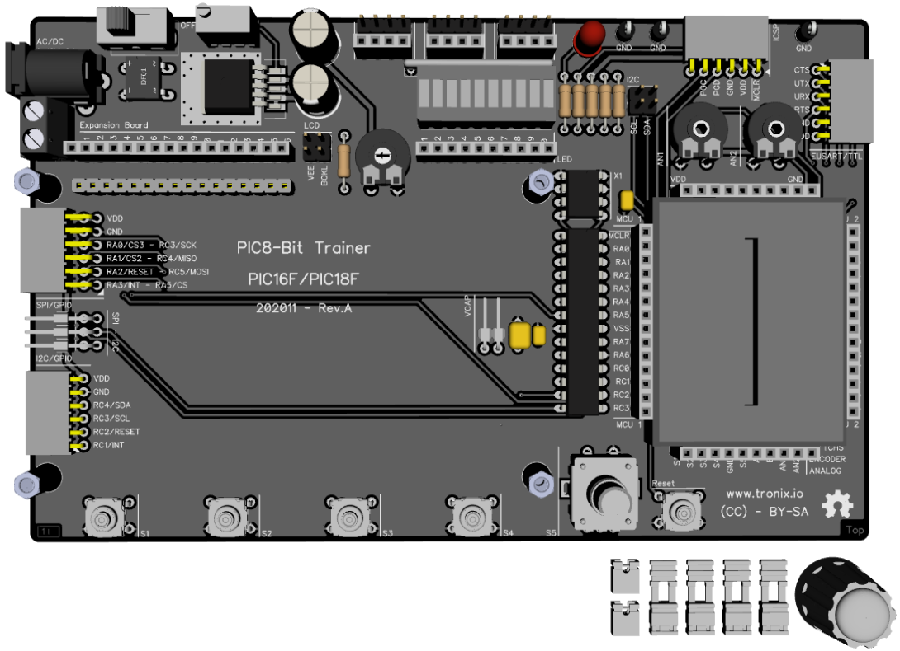

# PIC8-Bit Trainer.

## Features.

- 28 Pins PIC8-Bit Family (PIC16F/PIC18F).
- Powered with external DC or AC, variable regulated.
- Oscillator internal or external.
- Headers for breadboard and probes.
- I2C with jumpers.
- PCB 160x100mm.

## Schematic.

- [PIC8-Bit Trainer.](./assets/pic8bit-trainer.pdf)

## Code Examples.

- [PIC8-Bit Features.](https://github.com/tronixio/trainer-boards/tree/main/features/8bit/)
- [PIC16F1778 - ADC - BARGRAPH - ROTARY ENCODER.](./pic16f1778-trainer.md)

## Jumpers Configuration.

|PIC         |VCAP |
|------------|-----|
|PIC16F1778  |Open |
|PIC18F2xJ13 |Close|

## Board top.

## Board bottom.

---