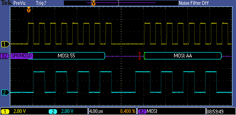

# PIC16F1777/8/9 - SPI.

## 0.Contents.

- [1.SPI Master.](#1spi-master)

## 1.SPI Master.

```c
// Configuration Registers.
#pragma config FOSC = INTOSC, WDTE = OFF, PWRTE = OFF, MCLRE = ON, CP = OFF
#pragma config BOREN = OFF, CLKOUTEN = OFF, IESO = OFF, FCMEN = OFF
#pragma config WRT = OFF, PPS1WAY = ON, ZCD = OFF, PLLEN = OFF
#pragma config STVREN = ON, BORV = LO, LPBOR = OFF, LVP = ON

#include <xc.h>
#include <stdint.h>
#define _XTAL_FREQ 8000000
// PIC16F1777/8/9 - Compile with XC8(v2.31).
// PIC16F1777/8/9 - @8MHz Internal Oscillator.

// SPI Master.

// MCU.RC3.MSSP.SCK  -> SCOPE.PROBE.A.
// MCU.RC5.MSSP.MISO -> SCOPE.PROBE.B.

// PIC8-Bit Nano Trainer.
// SDA - Open.
// SCL - Open.

// PIC8-Bit Mini Trainer.
// URX - Open.
// UTX - Open.
// SDA - Open.
// SCL - Open.
// VCAP - Open.
// BCKL - Open.

// PIC8-Bit Trainer.
// SDA - Open.
// SCL - Open.
// VEE - Open.
// BCKL - Open.
// VCAP - Open.
// SPI/I2C - SPI.

// Definitions.
// SPI.
#define SPI_CS    LATAbits.LATA5

// Main.
void main(void)
{
    // MCU Initialization.
    // Internal Oscillator.
    OSCCON = 0x70;
    // Ports Settings.
    // PORT Data Register.
    PORTA = 0b00000000;
    PORTB = 0b00000000;
    PORTC = 0b00000000;
    PORTE = 0b00000000;
    // TRIS Data Direction.
    TRISA = 0b00000000;
    TRISB = 0b00000000;
    TRISC = 0b00000000;
    TRISE = 0b00000000;
    // WPU Disable.
    OPTION_REGbits.nWPUEN = 0b1;
    // LATCH Outputs.
    LATA = 0b00100000;
    LATB = 0b00000000;
    LATC = 0b00000000;
    // ANSEL Analog.
    ANSELA = 0b00000000;
    ANSELB = 0b00000000;
    ANSELC = 0b00000000;
    // WPU Weak Pull-up.
    WPUA = 0b00000000;
    WPUB = 0b00000000;
    WPUC = 0b00000000;
    WPUE = 0b00000000;
    // ODCON Open-drain.
    ODCONA = 0b00000000;
    ODCONB = 0b00000000;
    ODCONC = 0b00000000;
    // SRLCON Slew Rate.
    SLRCONA = 0b11111111;
    SLRCONB = 0b11111111;
    SLRCONC = 0b11111111;
    // INLVL Input Level.
    INLVLA  = 0b00000000;
    INLVLB  = 0b00000000;
    INLVLC  = 0b00000000;
    // HIDRVB High Drive.
    HIDRVB  = 0b00000000;
    // PPS Settings.
    PPSLOCK = 0x55;
    PPSLOCK = 0xAA;
    PPSLOCKbits.PPSLOCKED = 0b0;
    // PPS Outputs.
    RC3PPSbits.RC3PPS = 0x21;  // RC3 - MSSP.SCK.
    RC5PPSbits.RC5PPS = 0x23;  // RC5 - MSSP.MOSI.
    PPSLOCK = 0x55;
    PPSLOCK = 0xAA;
    PPSLOCKbits.PPSLOCKED = 0b1;

    // SPI Mater Settings.
    // Mode 0 - Fsck = Fosc/16.
    SSP1BUF = 0;
    SSP1ADD = 0;
    SSP1MSK = 0;
    SSP1STAT = 0b01000000;
    SSP1CON1 = 0b00000001;
    SSP1CON2 = 0b00000000;
    SSP1CON3 = 0b00000000;
    // SPI Start.
    SSP1CON1bits.SSPEN = 0b1;

    uint8_t dummy;
    while(1){
        SPI_CS = 0b0;
        SSP1BUF = 0x55;
        while(!SSP1STATbits.BF);
        dummy = SSP1BUF;
        SSP1BUF = 0xAA;
        while(!SSP1STATbits.BF);
        dummy = SSP1BUF;
        SPI_CS = 0b1;
    }
}
```

<p align="center"></p>

---
DISCLAIMER: THIS CODE IS PROVIDED WITHOUT ANY WARRANTY OR GUARANTEES.
USERS MAY USE THIS CODE FOR DEVELOPMENT AND EXAMPLE PURPOSES ONLY.
AUTHORS ARE NOT RESPONSIBLE FOR ANY ERRORS, OMISSIONS, OR DAMAGES THAT COULD
RESULT FROM USING THIS FIRMWARE IN WHOLE OR IN PART.