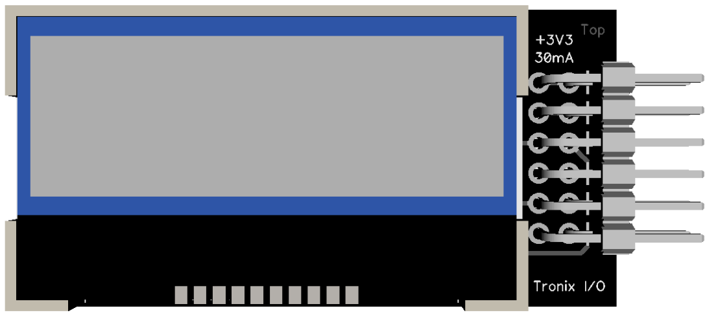
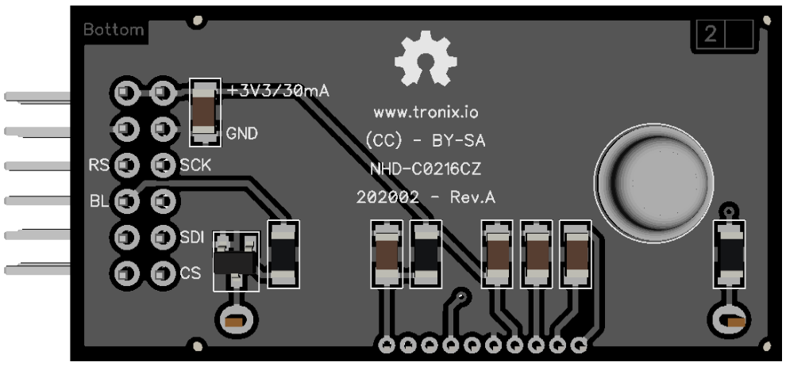
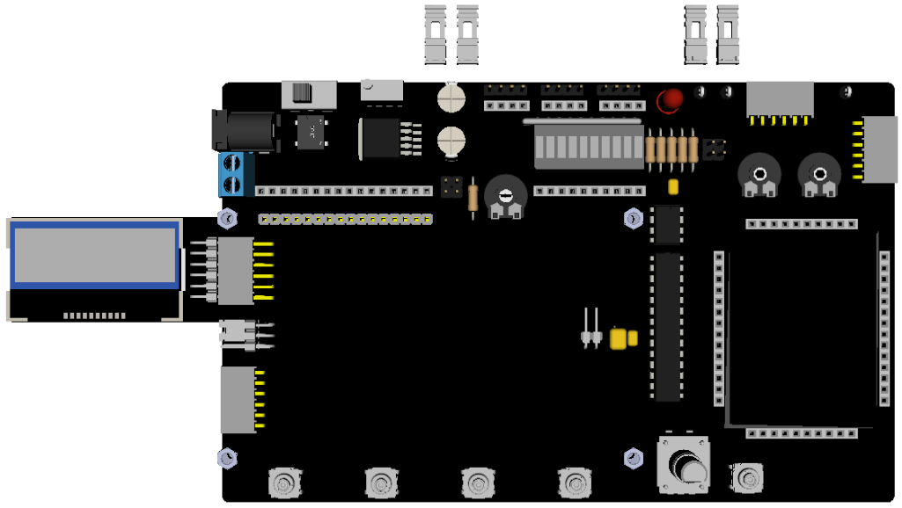

# NHD-C0216CZ.

## Features.

- 2 Lines x 16 Characters.
- ST7032 controller.
- 5x8 dots with cursor.
- Operating voltage : 3V3.
- Backlight : WHITE.
- [Datasheet NHD-C0216CZ-FSW-FBW-3V3.](https://www.newhavendisplay.com/specs/NHD-C0216CZ-FSW-FBW-3V3.pdf)
- [Datasheet ST7032.](http://www.newhavendisplay.com/app_notes/ST7032.pdf)

## Schematic.

- [Module SPI - NHD-C0216CZ.](./c0216cz.pdf)

## Code Examples.

- [PIC16F1773/6/8 - PIC8-Bit Trainer.](./c0216cz.md)

## Board top.

## Board bottom.

## PIC8-Bit Trainer with SPI Module.

---
THIS CODE IS PROVIDED WITHOUT ANY WARRANTY OR GUARANTEES.
USERS MAY USE THIS CODE FOR DEVELOPMENT AND EXAMPLE PURPOSES ONLY.
AUTHORS ARE NOT RESPONSIBLE FOR ANY ERRORS, OMISSIONS, OR DAMAGES THAT COULD
RESULT FROM USING THIS FIRMWARE IN WHOLE OR IN PART.