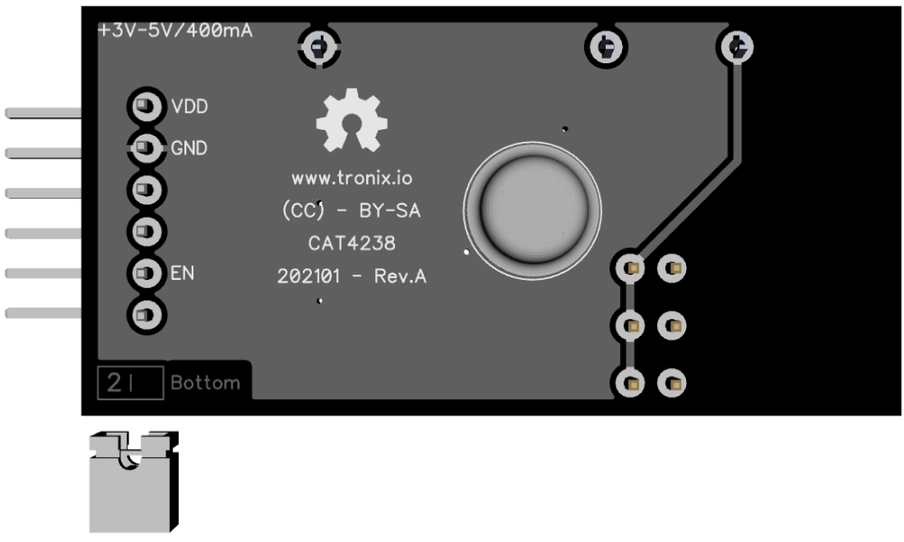

# cat4238.

## Features.

- Step-up DC/DC Converter 2~6 LED.
- [Datasheet CAT4238.](https://www.onsemi.com/pub/Collateral/CAT4238-D.PDF)

## Schematic.

- [Module GPIO - CAT4238.](./cat4238.pdf)

## Code Examples.

- [TODO - PIC16F1773/6/8 - PIC8-Bit Trainer.](./cat4238.md)

## Board top.

## Board bottom.

---
THIS CODE IS PROVIDED WITHOUT ANY WARRANTY OR GUARANTEES.
USERS MAY USE THIS CODE FOR DEVELOPMENT AND EXAMPLE PURPOSES ONLY.
AUTHORS ARE NOT RESPONSIBLE FOR ANY ERRORS, OMISSIONS, OR DAMAGES THAT COULD
RESULT FROM USING THIS FIRMWARE IN WHOLE OR IN PART.