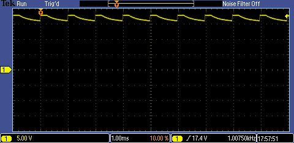
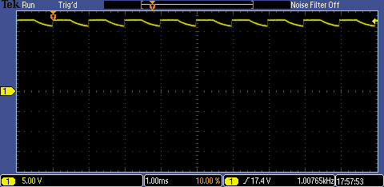
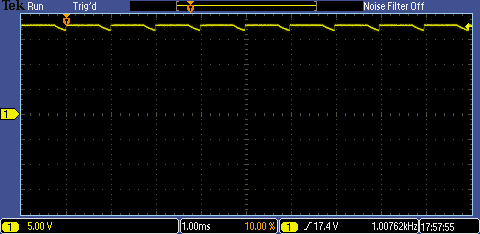

# DRAFT - CAT4238.

## Contents.

- [1.CAT4238 - PWM 10-Bit ~1kHz.](#1cat4238---pwm-10-bit-1khz)

## 1.CAT4238 - PWM 10-Bit ~1kHz.

```c
// Configuration Registers.
#pragma config FOSC = INTOSC, WDTE = OFF, PWRTE = OFF, MCLRE = ON, CP = OFF
#pragma config BOREN = OFF, CLKOUTEN = OFF, IESO = OFF, FCMEN = OFF
#pragma config WRT = OFF, PPS1WAY = ON, ZCD = OFF, PLLEN = OFF
#pragma config STVREN = ON, BORV = LO, LPBOR = OFF, LVP = ON

#include <xc.h>
#include <stdint.h>
#define _XTAL_FREQ 8000000
// PIC16F1773/6/8 - Compile with XC8(v2.30).
// PIC16F1773/6/8 - @8MHz Internal Oscillator.
// v0.1 - 11/2020.

// CAT4238 - PWM 10-Bit ~1kHz.

// Main.
void main(void)
{
    // MCU Initialization.
    // Internal Oscillator Settings.
    OSCCON = 0b01110000;
    // Ports Settings.
    // PORT Data Register.
    PORTA = 0b00000000;
    PORTB = 0b00000000;
    PORTC = 0b00000000;
    // TRIS Data Direction.
    TRISA = 0b00000000;
    TRISB = 0b00000000;
    TRISC = 0b00000000;
    // WPU Disable.
    OPTION_REGbits.nWPUEN = 0b1;
    // LATCH Outputs.
    LATA = 0b00000000;
    LATB = 0b00000000;
    LATC = 0b00000000;
    // ANSEL Analog.
    ANSELA = 0b00000000;
    ANSELB = 0b00000000;
    ANSELC = 0b00000000;
    // WPU Weak Pull-up.
    WPUA = 0b00000000;
    WPUB = 0b00000000;
    WPUC = 0b00000000;
    // ODCON Open-drain.
    ODCONA = 0b00000000;
    ODCONB = 0b00000000;
    ODCONC = 0b00000000;
    // SRLCON Slew Rate.
    SLRCONA = 0b11111111;
    SLRCONB = 0b11111111;
    SLRCONC = 0b11111111;
    // INLVL Input Level.
    INLVLA  = 0b00000000;
    INLVLB  = 0b00000000;
    INLVLC  = 0b00000000;
    // HIDRVB High Drive.
    HIDRVB  = 0b00000000;
    // PPS Settings.
    PPSLOCK = 0x55;
    PPSLOCK = 0xAA;  
    PPSLOCKbits.PPSLOCKED = 0b0;  
    // PPS Outputs.
    RC2PPSbits.RC2PPS = 0b011001;   // RC2 - PWM3.
    PPSLOCK = 0x55;
    PPSLOCK = 0xAA;
    PPSLOCKbits.PPSLOCKED = 0b1;

    // Timer2 Settings.
    // ~1kHz @8MHz.
    T2PR = 123;
    T2CON = 0b01000000;
    T2HLT = 0b00000000;
    T2CLKCON = 0b00000001;
    T2RST = 0b00000000;
    // Timer2 Enable.
    T2CONbits.ON = 0b1;

    // PWM3 Settings.
    PWM3DCL = 0;
    PWM3DCH = 0;
    PWM3CON = 0b00000000;
    // PWM3 Enable.
    PWM3CONbits.EN = 0b1;

    while(1){
        for(uint8_t dutyCycle=0; dutyCycle<125; dutyCycle++){
            PWM3DCH = dutyCycle;
            __delay_ms(50);
        }
        __delay_ms(1000);

        // LED Off.
        PWM3DCH = 0;
        __delay_ms(2000);
        // LED 25%.
        PWM3DCH = 31;
        __delay_ms(2000);
        // LED 50%.
        PWM3DCH = 62;
        __delay_ms(2000);
        // LED 75%.
        PWM3DCH = 93;
        __delay_ms(2000);
        // LED 100%.
        PWM3DCH = 125;
        __delay_ms(2000);
    }
}
```

- CAT4238 - Vout 25%.

<p align="center"></p>

- CAT4238 - Vout 50%.

<p align="center"></p>

- CAT4238 - Vout 75%.

<p align="center"></p>

- CAT4238 - Vout 100%.

<p align="center"></p>

---
DISCLAIMER: THIS CODE IS PROVIDED WITHOUT ANY WARRANTY OR GUARANTEES.
USERS MAY USE THIS CODE FOR DEVELOPMENT AND EXAMPLE PURPOSES ONLY.
AUTHORS ARE NOT RESPONSIBLE FOR ANY ERRORS, OMISSIONS, OR DAMAGES THAT COULD
RESULT FROM USING THIS FIRMWARE IN WHOLE OR IN PART.