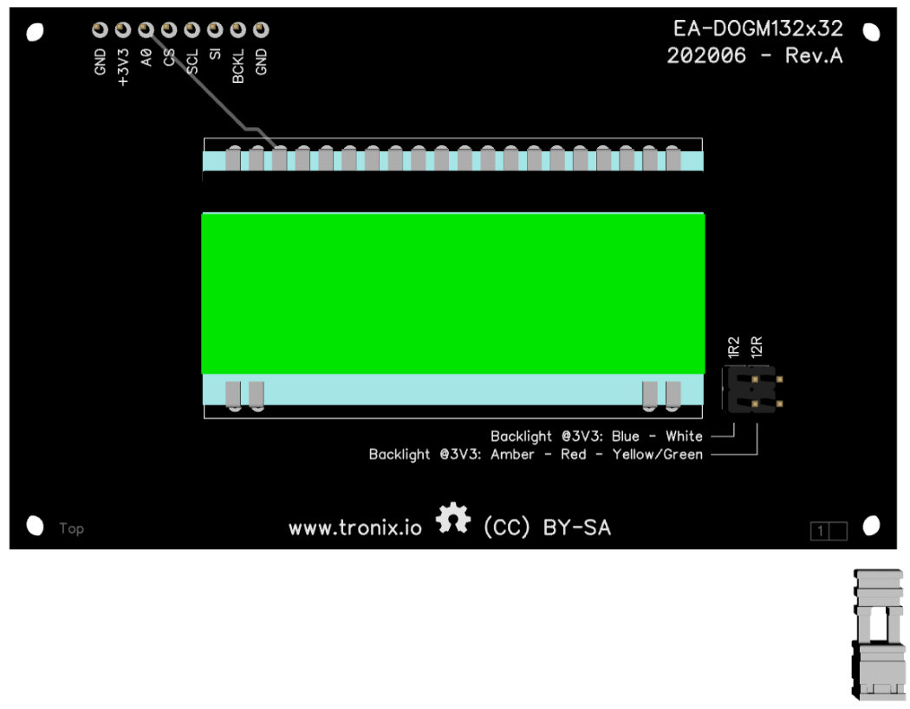
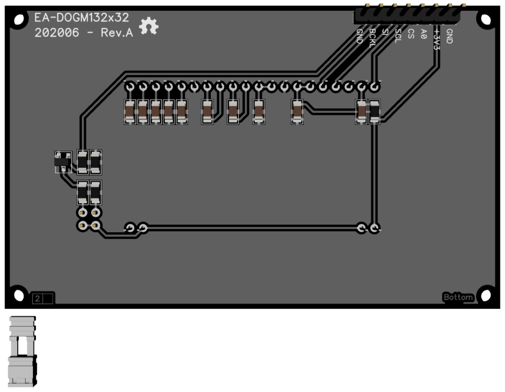

# EA-DOGM132.

## Features.

- 132x32 pixels.
- ST7565R controller.
- SPI.
- Operating voltage : 3V3.
- Backlight : AMBER - BLUE - RED - WHITE - YELLOW/GREEN.
- [Datasheet EA DOGM132.](https://www.lcd-module.com/eng/pdf/grafik/dogm132-5e.pdf)
- [Datasheet ST7565R.](https://www.crystalfontz.com/controllers/Sitronix/ST7565R/)

## Schematic.

- [Expansion Board - EA-DOGM132 - Rev.A.](./dogm132.pdf)

## Code Examples.

- [PIC16F1773/6/8 - EA-DOGM132 - PIC8-Bit Trainer.](./dogm132.md)

## Board top.

## Board bottom.

## PIC8-Bit Trainer with Expansion Board.

---
THIS CODE IS PROVIDED WITHOUT ANY WARRANTY OR GUARANTEES.
USERS MAY USE THIS CODE FOR DEVELOPMENT AND EXAMPLE PURPOSES ONLY.
AUTHORS ARE NOT RESPONSIBLE FOR ANY ERRORS, OMISSIONS, OR DAMAGES THAT COULD
RESULT FROM USING THIS FIRMWARE IN WHOLE OR IN PART.