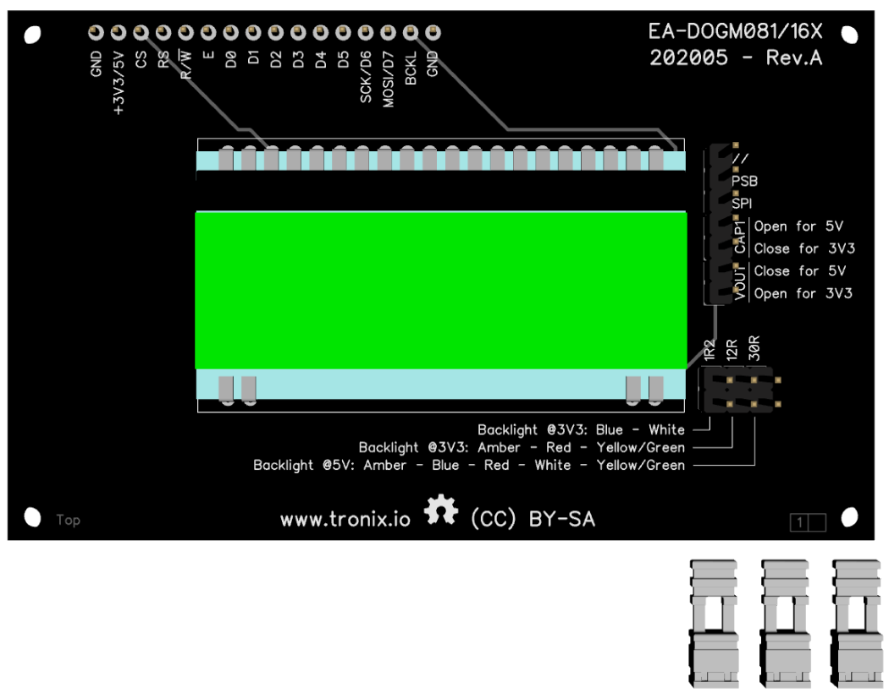
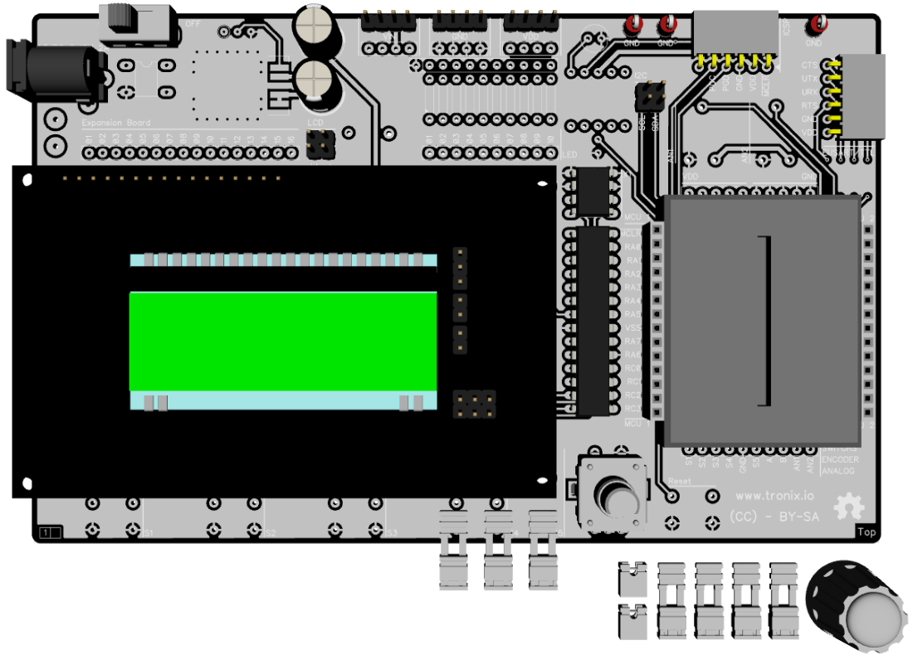

# EA-DOGM081/162/163.

## Features.

- 1/2/3 Lines 8/16 Characters.
- ST7036 controller.
- 4-bit, 8-bit and SPI.
- Operating voltage : 3V3 - 5V.
- Backlight : AMBER - BLUE - RED - WHITE - YELLOW/GREEN - RGB.
- [Datasheet EA DOGM081/162/163.](https://www.lcd-module.com/eng/pdf/doma/dog-me.pdf)
- [Datasheet ST7306.](https://www.crystalfontz.com/controllers/Sitronix/ST7036/)

## Schematic.

- [Expansion Board - EA-DOGM081/162/163 - Rev.A.](./dogm16x.pdf)

## Code Examples.

- [PIC16F1773/6/8 - EA-DOGM081 - PIC8-Bit Trainer.](./dogm081.md)
- [PIC16F1773/6/8 - EA-DOGM162 - PIC8-Bit Trainer.](./dogm162.md)
- [PIC16F1773/6/8 - EA-DOGM163 - PIC8-Bit Trainer.](./dogm163.md)

## Board top.

## Board bottom.

## PIC8-Bit Trainer with Expansion Board.

---
THIS CODE IS PROVIDED WITHOUT ANY WARRANTY OR GUARANTEES.
USERS MAY USE THIS CODE FOR DEVELOPMENT AND EXAMPLE PURPOSES ONLY.
AUTHORS ARE NOT RESPONSIBLE FOR ANY ERRORS, OMISSIONS, OR DAMAGES THAT COULD
RESULT FROM USING THIS FIRMWARE IN WHOLE OR IN PART.