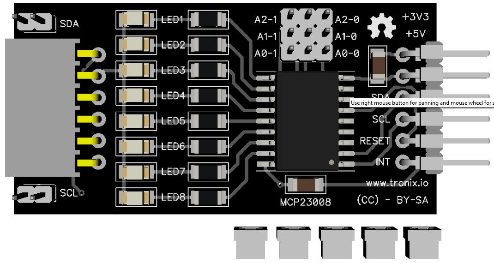
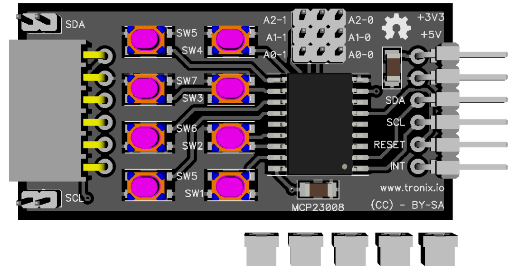
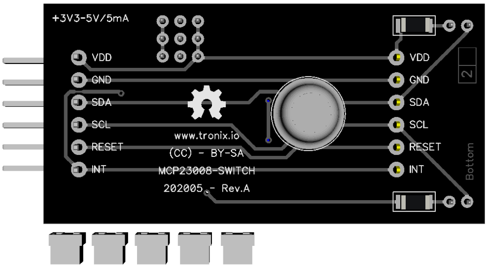
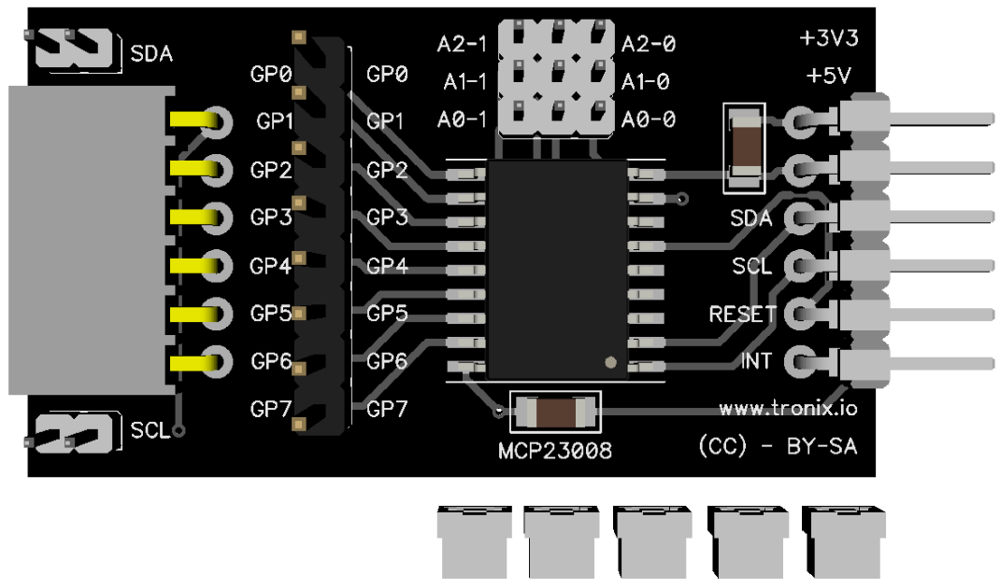
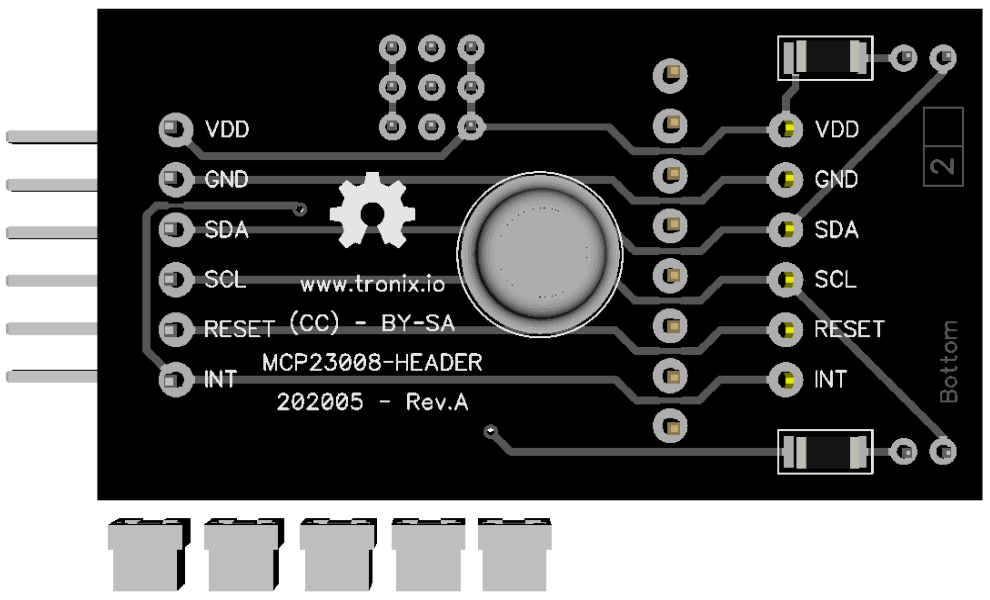

# TODO -  8-Bit I/O Expander - MCP23008.

## Features.

- 8-Bit I/O Expander with serial interface.
- Operating voltage : 1V8 - 5V5.
- [Datasheet MCP23008.](https://www.microchip.com/wwwproducts/en/MCP23008)

## Schematic.

- [TODO - Module I2C - MCP23008 with LED.](./mcp23008-led.pdf)
- [TODO - Module I2C - MCP23008 with Switch.](./mcp23008-switch.pdf)
- [TODO - Module I2C - MCP23008 with Header.](./mcp23008-header.pdf)

## Code Examples.

- [TODO - PIC16F1773/6/8 - MCP23008 Byte Mode - PIC8-Bit Trainer.](./mcp23008-byte.md)
- [TODO - PIC16F1773/6/8 - MCP23008 Sequential Mode - PIC8-Bit Trainer.](./mcp23008-sequential.md)

## MCP23008 with LED Board top.

## MCP23008 with LED Board bottom.

## MCP23008 with Switch Board top.

## MCP23008 with Switch Board bottom.

## MCP23008 with Header Board top.

## MCP23008 with Header Board bottom.

## PIC8-Bit Trainer with I2C Module.

---
THIS CODE IS PROVIDED WITHOUT ANY WARRANTY OR GUARANTEES.
USERS MAY USE THIS CODE FOR DEVELOPMENT AND EXAMPLE PURPOSES ONLY.
AUTHORS ARE NOT RESPONSIBLE FOR ANY ERRORS, OMISSIONS, OR DAMAGES THAT COULD
RESULT FROM USING THIS FIRMWARE IN WHOLE OR IN PART.