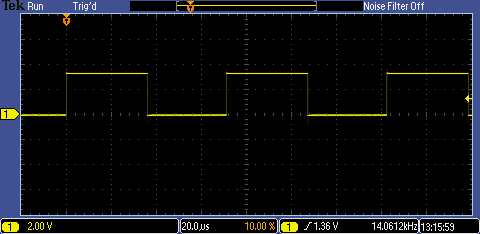

# TODO - MCP23008 Byte Mode.

## Contents.

- [1.TODO - PIC16F1773/6/8 Module I2C MCP23008 LED.](#1todo---pic16f177368-module-i2c-mcp23008-led)
- [2.TODO - PIC16F1773/6/8 Module I2C MCP23008 Switch.](#2todo---pic16f177368-module-i2c-mcp23008-switch)
- [3.TODO - PIC16F1773/6/8 Module I2C MCP23008 Header.](#3todo---pic16f177368-module-i2c-mcp23008-header)

## 1.TODO - PIC16F1773/6/8 Module I2C MCP23008 LED.

```c
// Configuration Registers.
#pragma config FOSC = INTOSC, WDTE = OFF, PWRTE = OFF, MCLRE = ON, CP = OFF
#pragma config BOREN = OFF, CLKOUTEN = OFF, IESO = OFF, FCMEN = OFF
#pragma config WRT = OFF, PPS1WAY = ON, ZCD = OFF, PLLEN = OFF
#pragma config STVREN = ON, BORV = LO, LPBOR = OFF, LVP = ON

#include <xc.h>
#include <stdint.h>
#define _XTAL_FREQ 8000000
// PIC16F1778 - Compile with XC8(v2.30).
// PIC16F1778 - @8MHz Internal Oscillator.
// v.0.1 - 05/2020.

// Module I2C MCP23008 LED Byte Mode.

// PIC8-Bit Trainer.
// Jumpers.
// SDA - Close.
// SCL - Close.
// VEE - Open.
// BCKL - Open.
// VCAP - Open.
// SPI/I2C - Open.

// Module Jumpers.
// MCP23008.A2 - 0.
// MCP23008.A1 - 0.
// MCP23008.A0 - 0.
// MCP23008.SCL - Open.
// MCP23008.SDA - Open.

// Definitions.
// I2C.
#define I2C_READ                            0b0
#define I2C_WRITE                           0b0
#define I2C_FSCL_HZ                         400000
#define I2C_ADD                             ((_XTAL_FREQ/(4*I2C_FSCL_HZ))-1)
// MCP23008 PIN.
#define MCP23008_RESET                      LATCbits.LATC2
// MCP23008 Address Select Bits A2 A1 A0.
#define MCP23008_ADDRESS_40                 0x40
#define MCP23008_ADDRESS_42                 0x42
#define MCP23008_ADDRESS_44                 0x44
#define MCP23008_ADDRESS_46                 0x46
#define MCP23008_ADDRESS_48                 0x48
#define MCP23008_ADDRESS_4A                 0x4A
#define MCP23008_ADDRESS_4C                 0x4C
#define MCP23008_ADDRESS_4E                 0x4E
// MCP23008 Configuration Registers.
#define MCP23008_IODIR                      0x00
#define MCP23008_IPOL                       0x01
#define MCP23008_GPINTEN                    0x02
#define MCP23008_DEFVAL                     0x03
#define MCP23008_INTCON                     0x04
#define MCP23008_IOCON                      0x05
#define MCP23008_GPPU                       0x06
#define MCP23008_INTF                       0x07
#define MCP23008_INTCAP                     0x08
#define MCP23008_GPIO                       0x09
#define MCP23008_OLAT                       0x0A
// MCP23008 Configuration Bits.
#define MCP23008_SEQOP                      0x20
#define MCP23008_HAEN                       0x08
#define MCP23008_ODR                        0x04
#define MCP23008_INTPOL                     0x02
#define MCP23008_INITIALIZATION_DELAY_MS    5
// MCP23008 Configuration.
#define MCP23008_CONFIGURATION_I2C_ADDRESS  MCP23008_ADDRESS_40
#define DELAY                               50

// Function Prototypes.
uint8_t i2c_read(void);
void i2c_restart(void);
void i2c_start(void);
void i2c_stop(void);
void i2c_write(uint8_t u8Data);
void mcp23008_initialize(uint8_t u8Address);
uint8_t mcp23008_readRegister(uint8_t u8Address, uint8_t u8Register);
void mcp23008_writeRegister(uint8_t u8Address, uint8_t u8Register, uint8_t u8Data);

// Main.
void main(void)
{
    // MCU Initialization.
    // Internal Oscillator Settings.
    OSCCON = 0x70;
    // Ports Settings.
    // PORT Data Register.
    PORTA = 0b00000000;
    PORTB = 0b00000000;
    PORTC = 0b00000000;
    PORTE = 0b00000000;
    // TRIS Data Direction.
    TRISA = 0b00000000;
    TRISB = 0b00000000;
    TRISC = 0b00011000;
    TRISE = 0b00000000;
    // WPU Disable.
    OPTION_REGbits.nWPUEN = 0b1;
    // LATCH Outputs.
    LATA = 0b00000000;
    LATB = 0b00000000;
    LATC = 0b00011000;
    // ANSEL Analog.
    ANSELA = 0b00000000;
    ANSELB = 0b00000000;
    ANSELC = 0b00000000;
    // WPU Weak Pull-up.
    WPUA = 0b00000000;
    WPUB = 0b00000000;
    WPUC = 0b00000000;
    WPUE = 0b00000000;
    // ODCON Open-drain.
    ODCONA = 0b00000000;
    ODCONB = 0b00000000;
    ODCONC = 0b00000000;
    // SRLCON Slew Rate.
    SLRCONA = 0b11111111;
    SLRCONB = 0b11111111;
    SLRCONC = 0b11111111;
    // INLVL Input Level.
    INLVLA  = 0b00000000;
    INLVLB  = 0b00000000;
    INLVLC  = 0b00000000;
    // HIDRVB High Drive.
    HIDRVB  = 0b00000000;
    // PPS Settings.
    PPSLOCK = 0x55;
    PPSLOCK = 0xAA;
    PPSLOCKbits.PPSLOCKED = 0b0;
    // PPS Inputs.
    SSPDATPPSbits.SSPDATPPS = 0x14;  // RC4 - MSSP.SDA.
    // PPS Outputs.
    RC3PPSbits.RC3PPS = 0x21;        // RC3 - MSSP.SCL.
    RC4PPSbits.RC4PPS = 0x22;        // RC4 - MSSP.SDA.
    PPSLOCK = 0x55;
    PPSLOCK = 0xAA;
    PPSLOCKbits.PPSLOCKED = 0b1;

    // I2C Master Settings.
    SSP1BUF = 0;
    SSP1ADD = I2C_ADD;
    SSP1STAT = 0x00;
    SSP1CON1 = 0x08;
    SSP1CON2 = 0x00;
    SSP1CON3 = 0x00;
     // I2C Enable.
    SSP1CON1bits.SSPEN = 0b1;

    // MCP23008 Initialization.
    mcp23008_initialize(MCP23008_CONFIGURATION_I2C_ADDRESS);

    // MCP23008 in Byte Mode.
    mcp23008_writeRegister(MCP23008_CONFIGURATION_I2C_ADDRESS, MCP23008_IOCON, MCP23008_SEQOP);

    uint8_t u8Repeat;
    i2c_start();
    i2c_write(MCP23008_CONFIGURATION_I2C_ADDRESS);
    i2c_write(MCP23008_GPIO);
    while(1){
        for(u8Repeat=0; u8Repeat<5; u8Repeat++){
            i2c_write(0x01);
            __delay_ms(DELAY);
            i2c_write(0x03);
            __delay_ms(DELAY);
            i2c_write(0x07);
            __delay_ms(DELAY);
            i2c_write(0x0F);
            __delay_ms(DELAY);
            i2c_write(0x1F);
            __delay_ms(DELAY);
            i2c_write(0x3F);
            __delay_ms(DELAY);
            i2c_write(0x7F);
            __delay_ms(DELAY);
            i2c_write(0xFF);
            __delay_ms(DELAY);

            i2c_write(0xFE);
            __delay_ms(DELAY);
            i2c_write(0xFC);
            __delay_ms(DELAY);
            i2c_write(0xF8);
            __delay_ms(DELAY);
            i2c_write(0xF0);
            __delay_ms(DELAY);
            i2c_write(0xE0);
            __delay_ms(DELAY);
            i2c_write(0xC0);
            __delay_ms(DELAY);
            i2c_write(0x80);
            __delay_ms(DELAY);
            i2c_write(0x00);
            __delay_ms(DELAY);
        }

        for(u8Repeat=0; u8Repeat<5; u8Repeat++){
            i2c_write(0x01);
            __delay_ms(DELAY);
            i2c_write(0x02);
            __delay_ms(DELAY);
            i2c_write(0x04);
            __delay_ms(DELAY);
            i2c_write(0x08);
            __delay_ms(DELAY);
            i2c_write(0x10);
            __delay_ms(DELAY);
            i2c_write(0x20);
            __delay_ms(DELAY);
            i2c_write(0x40);
            __delay_ms(DELAY);
            i2c_write(0x80);
            __delay_ms(DELAY);

            i2c_write(0x40);
            __delay_ms(DELAY);
            i2c_write(0x20);
            __delay_ms(DELAY);
            i2c_write(0x10);
            __delay_ms(DELAY);
            i2c_write(0x08);
            __delay_ms(DELAY);
            i2c_write(0x04);
            __delay_ms(DELAY);
            i2c_write(0x02);
            __delay_ms(DELAY);
        }

        for(u8Repeat=0; u8Repeat<10; u8Repeat++){
            i2c_write(0x55);
            __delay_ms(DELAY);
            i2c_write(0xAA);
            __delay_ms(DELAY);
        }
    }
}

// Functions.
uint8_t i2c_read(void)
{
    while(SSP1CON2 & 0x1F){};
    SSP1CON2bits.RCEN = 0b1;
    while(!SSP1STATbits.BF){};

    return(SSP1BUF);
}

void i2c_restart(void)
{
    while(SSP1CON2 & 0x1F){};
    SSP1CON2bits.RSEN = 0b1;
    while(SSP1CON2bits.RSEN){};
}

void i2c_start(void)
{
    while(SSP1CON2 & 0x1F){};
    SSP1CON2bits.SEN = 0b1;
    while(SSP1CON2bits.SEN){};
}

void i2c_stop(void)
{
    while(SSP1CON2 & 0x1F){};
    SSP1CON2bits.PEN = 0b1;
    while(SSP1CON2bits.PEN){};
}

void i2c_write(uint8_t u8Data)
{
    SSP1BUF = u8Data;
    while(SSP1STATbits.BF){};
}

void mcp23008_initialize(uint8_t u8Address)
{
    MCP23008_RESET = 0b1;
    __delay_ms(MCP23008_INITIALIZATION_DELAY_MS);

    i2c_start();
    i2c_write(u8Address | I2C_WRITE);
    // IODIR - I/O Direction - 0b11111111 (Default).
    // IO7.0 = 0 PIN as configured as Output.
    // IO7.0 = 1 PIN as configured as Input.
    i2c_write(MCP23008_IODIR);
    i2c_write(0b00000000);
    // IPOL - Input Polarity - 0b00000000 (Default).
    // IP7.0 = 0 GPIO Register bit will reflect the same logic state of the input pin.
    // IP7.0 = 1 GPIO Register bit will reflect the opposite logic state of the input pin.
    i2c_write(0b00000000);
    // GPINTEN - Interrupt-on-change - 0b00000000 (Default).
    // GPINT7.0 = 0 Disable GPIO input PIN for interrupt-on-change event.
    // GPINT7.0 = 1 Enable GPIO input PIN for interrupt-on-change event.
    i2c_write(0b00000000);
    // DEFVAL - Default Compare Interrupt-on-change - 0b00000000 (Default).
    i2c_write(0b00000000);
    // INTCON - Interrupt Control - 0b00000000 (Default).
    // IOC7.0 = 0 PIN value is compared against the previous PIN value.
    // IOC7.0 = 1 Control how the associated PIN value is compared for interrupt-on-change.
    i2c_write(0b00000000);
    // IOCON - Configuration - 0b--00000- (Default).
    // SEQOP - Sequential Operation - 0 = Sequential enable, 1 = Sequential disable.
    // DISSLW - Slew Rate Control for SDA output - 0 = Slew rate enabled, 1 = Slew rate disabled.
    // ODR - Open-drain PIN output - 0 = Active driver output, 1 = Open-drain output.
    // INTPOL - Set the polarity of the INT output pin - 0 = Active LOW, 1 = Active HIGH.
    i2c_write(0b00000000);
    // GPPU - Pull-up resistor - 0b00000000 (Default).
    // PU7.0 = 0 Pull-up disabled.
    // PU7.0 = 1 Pull-up enabled.
    i2c_write(0b00000000);
    // INTF - Interrupt Flag - 0b00000000 (Default) - Read-only.
    // INT7.0 = 0 Interrupt not pending.
    // INT7.0 = 1 PIN caused interrupt.
    i2c_write(0b00000000);
    // INTCAP - Interrupt Capture - 0b00000000 (Default) Read-only.
    // ICP7.0 = 0 Logic-low.
    // ICP7.0 = 1 Logic-high.
    i2c_write(0b00000000);
    // GPIO - Port GPIO - 0b00000000 (Default).
    // GP7.0 = 0 Logic-low.
    // GP7.0 = 1 Logic-high.
    i2c_write(0b00000000);
    // OLAT - Output Latch - 0b00000000 (Default).
    // OL7.0 = 0 Logic-low.
    // OL7.0 = 1 Logic-high.
    i2c_write(0b00000000);
    i2c_stop();
}

uint8_t mcp23008_readRegister(uint8_t u8Address, uint8_t u8Register)
{
    uint8_t u8Read;

    i2c_start();
    i2c_write(u8Address | I2C_WRITE);
    i2c_write(u8Register);
    i2c_restart();
    i2c_write(u8Address | I2C_READ);
    u8Read = i2c_read();
    i2c_stop();

    return(u8Read);
}

void mcp23008_writeRegister(uint8_t u8Address, uint8_t u8Register,  uint8_t u8Data)
{
    i2c_start();
    i2c_write(u8Address | I2C_WRITE);
    i2c_write(u8Register);
    i2c_write(u8Data);
    i2c_stop();
}
```

## 2.TODO - PIC16F1773/6/8 Module I2C MCP23008 Switch.

```c
```

## 3.TODO - PIC16F1773/6/8 Module I2C MCP23008 Header.

```c
// Configuration Registers.
#pragma config FOSC = INTOSC, WDTE = OFF, PWRTE = OFF, MCLRE = ON, CP = OFF
#pragma config BOREN = OFF, CLKOUTEN = OFF, IESO = OFF, FCMEN = OFF
#pragma config WRT = OFF, PPS1WAY = ON, ZCD = OFF, PLLEN = OFF
#pragma config STVREN = ON, BORV = LO, LPBOR = OFF, LVP = ON

#include <xc.h>
#include <stdint.h>
#define _XTAL_FREQ 8000000
// PIC16F1778 - Compile with XC8(v2.30).
// PIC16F1778 - @8MHz Internal Oscillator.
// v.0.1 - 05/2020.

// Module I2C MCP23008 Header Byte Mode.

// PIC8-Bit Trainer.
// Jumpers.
// SDA - Close.
// SCL - Close.
// VEE - Open.
// BCKL - Open.
// VCAP - Open.
// SPI/I2C - Open.

// Module Jumpers.
// MCP23008.A2 - 0.
// MCP23008.A1 - 0.
// MCP23008.A0 - 0.
// MCP23008.SCL - Open.
// MCP23008.SDA - Open.

// Definitions.
// I2C.
#define I2C_READ                            0b0
#define I2C_WRITE                           0b0
#define I2C_FSCL_HZ                         400000
#define I2C_ADD                             ((_XTAL_FREQ/(4*I2C_FSCL_HZ))-1)
// MCP23008 PIN.
#define MCP23008_RESET                      LATCbits.LATC2
// MCP23008 Address Select Bits A2 A1 A0.
#define MCP23008_ADDRESS_40                 0x40
#define MCP23008_ADDRESS_42                 0x42
#define MCP23008_ADDRESS_44                 0x44
#define MCP23008_ADDRESS_46                 0x46
#define MCP23008_ADDRESS_48                 0x48
#define MCP23008_ADDRESS_4A                 0x4A
#define MCP23008_ADDRESS_4C                 0x4C
#define MCP23008_ADDRESS_4E                 0x4E
// MCP23008 Configuration Registers.
#define MCP23008_IODIR                      0x00
#define MCP23008_IPOL                       0x01
#define MCP23008_GPINTEN                    0x02
#define MCP23008_DEFVAL                     0x03
#define MCP23008_INTCON                     0x04
#define MCP23008_IOCON                      0x05
#define MCP23008_GPPU                       0x06
#define MCP23008_INTF                       0x07
#define MCP23008_INTCAP                     0x08
#define MCP23008_GPIO                       0x09
#define MCP23008_OLAT                       0x0A
// MCP23008 Configuration Bits.
#define MCP23008_SEQOP                      0x20
#define MCP23008_HAEN                       0x08
#define MCP23008_ODR                        0x04
#define MCP23008_INTPOL                     0x02
#define MCP23008_INITIALIZATION_DELAY_MS    5
// MCP23008 Configuration.
#define MCP23008_CONFIGURATION_I2C_ADDRESS  MCP23008_ADDRESS_40
#define DELAY                               50

// Function Prototypes.
uint8_t i2c_read(void);
void i2c_restart(void);
void i2c_start(void);
void i2c_stop(void);
void i2c_write(uint8_t u8Data);
void mcp23008_initialize(uint8_t u8Address);
uint8_t mcp23008_readRegister(uint8_t u8Address, uint8_t u8Register);
void mcp23008_writeRegister(uint8_t u8Address, uint8_t u8Register, uint8_t u8Data);

// Main.
void main(void)
{
    // MCU Initialization.
    // Internal Oscillator Settings.
    OSCCON = 0x70;
    // Ports Settings.
    // PORT Data Register.
    PORTA = 0b00000000;
    PORTB = 0b00000000;
    PORTC = 0b00000000;
    PORTE = 0b00000000;
    // TRIS Data Direction.
    TRISA = 0b00000000;
    TRISB = 0b00000000;
    TRISC = 0b00011000;
    TRISE = 0b00000000;
    // WPU Disable.
    OPTION_REGbits.nWPUEN = 0b1;
    // LATCH Outputs.
    LATA = 0b00000000;
    LATB = 0b00000000;
    LATC = 0b00011000;
    // ANSEL Analog.
    ANSELA = 0b00000000;
    ANSELB = 0b00000000;
    ANSELC = 0b00000000;
    // WPU Weak Pull-up.
    WPUA = 0b00000000;
    WPUB = 0b00000000;
    WPUC = 0b00000000;
    WPUE = 0b00000000;
    // ODCON Open-drain.
    ODCONA = 0b00000000;
    ODCONB = 0b00000000;
    ODCONC = 0b00000000;
    // SRLCON Slew Rate.
    SLRCONA = 0b11111111;
    SLRCONB = 0b11111111;
    SLRCONC = 0b11111111;
    // INLVL Input Level.
    INLVLA  = 0b00000000;
    INLVLB  = 0b00000000;
    INLVLC  = 0b00000000;
    // HIDRVB High Drive.
    HIDRVB  = 0b00000000;
    // PPS Settings.
    PPSLOCK = 0x55;
    PPSLOCK = 0xAA;
    PPSLOCKbits.PPSLOCKED = 0b0;
    // PPS Inputs.
    SSPDATPPSbits.SSPDATPPS = 0x14;  // RC4 - MSSP.SDA.
    // PPS Outputs.
    RC3PPSbits.RC3PPS = 0x21;        // RC3 - MSSP.SCL.
    RC4PPSbits.RC4PPS = 0x22;        // RC4 - MSSP.SDA.
    PPSLOCK = 0x55;
    PPSLOCK = 0xAA;
    PPSLOCKbits.PPSLOCKED = 0b1;

    // I2C Master Settings.
    SSP1BUF = 0;
    SSP1ADD = I2C_ADD;
    SSP1STAT = 0x00;
    SSP1CON1 = 0x08;
    SSP1CON2 = 0x00;
    SSP1CON3 = 0x00;
     // I2C Enable.
    SSP1CON1bits.SSPEN = 0b1;

    // MCP23008 Initialization.
    mcp23008_initialize(MCP23008_CONFIGURATION_I2C_ADDRESS);

    // MCP23008 in Byte Mode.
    mcp23008_writeRegister(MCP23008_CONFIGURATION_I2C_ADDRESS, MCP23008_IOCON, MCP23008_SEQOP);

    i2c_start();
    i2c_write(MCP23008_CONFIGURATION_I2C_ADDRESS);
    i2c_write(MCP23008_GPIO);
    while(1){
        i2c_write(0x00);
        i2c_write(0xFF);
    }
}

// Functions.
uint8_t i2c_read(void)
{
    while(SSP1CON2 & 0x1F){};
    SSP1CON2bits.RCEN = 0b1;
    while(!SSP1STATbits.BF){};

    return(SSP1BUF);
}

void i2c_restart(void)
{
    while(SSP1CON2 & 0x1F){};
    SSP1CON2bits.RSEN = 0b1;
    while(SSP1CON2bits.RSEN){};
}

void i2c_start(void)
{
    while(SSP1CON2 & 0x1F){};
    SSP1CON2bits.SEN = 0b1;
    while(SSP1CON2bits.SEN){};
}

void i2c_stop(void)
{
    while(SSP1CON2 & 0x1F){};
    SSP1CON2bits.PEN = 0b1;
    while(SSP1CON2bits.PEN){};
}

void i2c_write(uint8_t u8Data)
{
    SSP1BUF = u8Data;
    while(SSP1STATbits.BF){};
}

void mcp23008_initialize(uint8_t u8Address)
{
    MCP23008_RESET = 0b1;
    __delay_ms(MCP23008_INITIALIZATION_DELAY_MS);

    i2c_start();
    i2c_write(u8Address | I2C_WRITE);
    // IODIR - I/O Direction - 0b11111111 (Default).
    // IO7.0 = 0 PIN as configured as Output.
    // IO7.0 = 1 PIN as configured as Input.
    i2c_write(MCP23008_IODIR);
    i2c_write(0b00000000);
    // IPOL - Input Polarity - 0b00000000 (Default).
    // IP7.0 = 0 GPIO Register bit will reflect the same logic state of the input pin.
    // IP7.0 = 1 GPIO Register bit will reflect the opposite logic state of the input pin.
    i2c_write(0b00000000);
    // GPINTEN - Interrupt-on-change - 0b00000000 (Default).
    // GPINT7.0 = 0 Disable GPIO input PIN for interrupt-on-change event.
    // GPINT7.0 = 1 Enable GPIO input PIN for interrupt-on-change event.
    i2c_write(0b00000000);
    // DEFVAL - Default Compare Interrupt-on-change - 0b00000000 (Default).
    i2c_write(0b00000000);
    // INTCON - Interrupt Control - 0b00000000 (Default).
    // IOC7.0 = 0 PIN value is compared against the previous PIN value.
    // IOC7.0 = 1 Control how the associated PIN value is compared for interrupt-on-change.
    i2c_write(0b00000000);
    // IOCON - Configuration - 0b--00000- (Default).
    // SEQOP - Sequential Operation - 0 = Sequential enable, 1 = Sequential disable.
    // DISSLW - Slew Rate Control for SDA output - 0 = Slew rate enabled, 1 = Slew rate disabled.
    // ODR - Open-drain PIN output - 0 = Active driver output, 1 = Open-drain output.
    // INTPOL - Set the polarity of the INT output pin - 0 = Active LOW, 1 = Active HIGH.
    i2c_write(0b00000000);
    // GPPU - Pull-up resistor - 0b00000000 (Default).
    // PU7.0 = 0 Pull-up disabled.
    // PU7.0 = 1 Pull-up enabled.
    i2c_write(0b00000000);
    // INTF - Interrupt Flag - 0b00000000 (Default) - Read-only.
    // INT7.0 = 0 Interrupt not pending.
    // INT7.0 = 1 PIN caused interrupt.
    i2c_write(0b00000000);
    // INTCAP - Interrupt Capture - 0b00000000 (Default) Read-only.
    // ICP7.0 = 0 Logic-low.
    // ICP7.0 = 1 Logic-high.
    i2c_write(0b00000000);
    // GPIO - Port GPIO - 0b00000000 (Default).
    // GP7.0 = 0 Logic-low.
    // GP7.0 = 1 Logic-high.
    i2c_write(0b00000000);
    // OLAT - Output Latch - 0b00000000 (Default).
    // OL7.0 = 0 Logic-low.
    // OL7.0 = 1 Logic-high.
    i2c_write(0b00000000);
    i2c_stop();
}

uint8_t mcp23008_readRegister(uint8_t u8Address, uint8_t u8Register)
{
    uint8_t u8Read;

    i2c_start();
    i2c_write(u8Address | I2C_WRITE);
    i2c_write(u8Register);
    i2c_restart();
    i2c_write(u8Address | I2C_READ);
    u8Read = i2c_read();
    i2c_stop();

    return(u8Read);
}

void mcp23008_writeRegister(uint8_t u8Address, uint8_t u8Register,  uint8_t u8Data)
{
    i2c_start();
    i2c_write(u8Address | I2C_WRITE);
    i2c_write(u8Register);
    i2c_write(u8Data);
    i2c_stop();
}
```

<p align="center"></p>

---
DISCLAIMER: THIS CODE IS PROVIDED WITHOUT ANY WARRANTY OR GUARANTEES.
USERS MAY USE THIS CODE FOR DEVELOPMENT AND EXAMPLE PURPOSES ONLY.
AUTHORS ARE NOT RESPONSIBLE FOR ANY ERRORS, OMISSIONS, OR DAMAGES THAT COULD
RESULT FROM USING THIS FIRMWARE IN WHOLE OR IN PART.