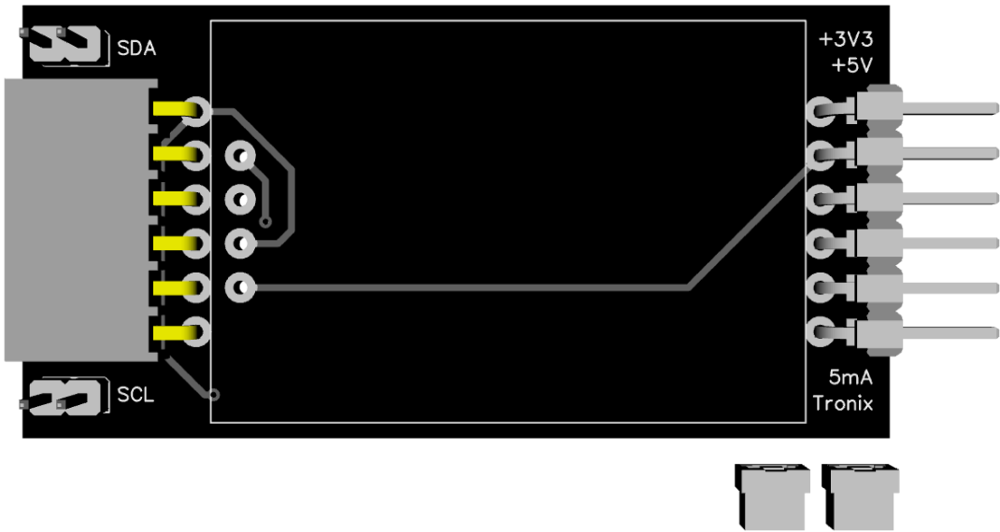

# OLED0.96.

## Features.

- 128x64 pixels.
- SSD1306 controller.
- Operating voltage : 3V3 - 5V.
- 3 Colors : BLUE - WHITE - YELLOW/BLUE.
- [Datasheet SSD1306.](https://www.crystalfontz.com/controllers/SolomonSystech/SSD1306/)

## Schematic.

- [Module I2C - OLED 0.96.](./oled096.pdf)

## Code Examples.

- [PIC16F1773/6/8 - PIC8-Bit Trainer.](./oled.md)

## Board top.

## Board bottom.

## PIC8-Bit Trainer with I2C Module.

---
THIS CODE IS PROVIDED WITHOUT ANY WARRANTY OR GUARANTEES.
USERS MAY USE THIS CODE FOR DEVELOPMENT AND EXAMPLE PURPOSES ONLY.
AUTHORS ARE NOT RESPONSIBLE FOR ANY ERRORS, OMISSIONS, OR DAMAGES THAT COULD
RESULT FROM USING THIS FIRMWARE IN WHOLE OR IN PART.